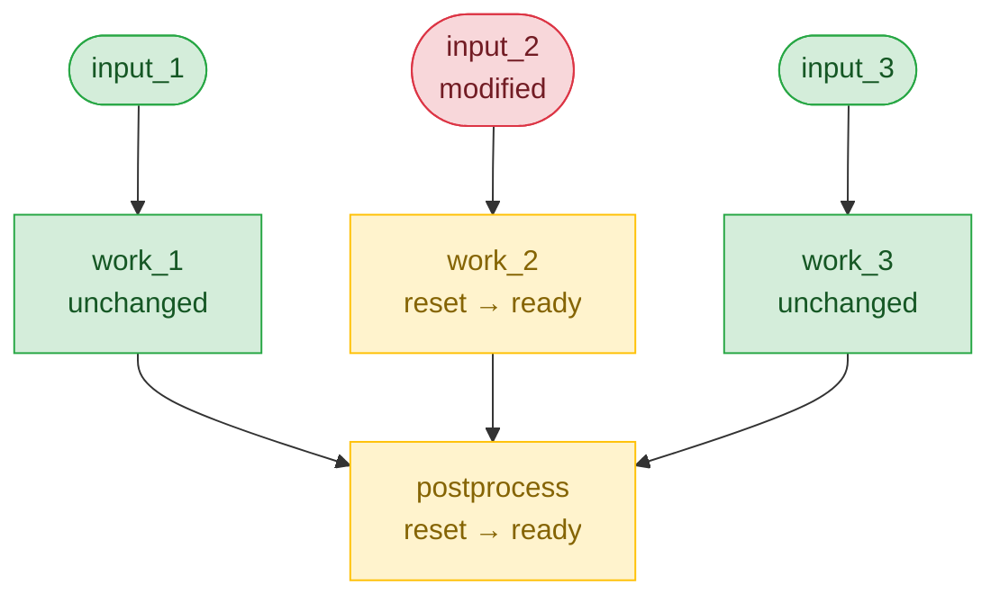

# Intelligent Restart

When you modify input files or configuration after a workflow has run, you need a way to re-execute
only the affected jobs. Intelligent restart — implemented by `torc workflows reinit` — detects what
changed and resets just the jobs whose inputs are now stale, then propagates that reset through the
dependency graph.

> **Note:** Intelligent restart is for _correct workflows that need to be rerun with different
> inputs_. For _failed_ workflows, use
> [`torc recover`](../../specialized/fault-tolerance/automatic-recovery.md) instead — it diagnoses
> failures, adjusts resources, and resubmits jobs.

## Motivating Example

Suppose you have three input files, each consumed by a `work` job, that fan in to a `postprocess`
job. The workflow completes successfully, but you discover a bug in `input_2`. After fixing it, you
run:

```bash
torc workflows reinit <workflow_id>
```

Torc detects that `input_2` was modified, resets `work_2` (which reads it) and `postprocess` (which
depends on `work_2`'s output), and leaves `work_1` and `work_3` alone:



## When to Use

Use `torc workflows reinit` when:

- **Input files changed** — You modified an input file and want dependent jobs to rerun
- **Configuration updated** — You changed `user_data` parameters
- **Output files missing** — Output files were deleted and need regeneration
- **Job definition changed** — You modified a job's command or other attributes
- **Iterative development** — You're refining a workflow and need quick iteration

## Basic Usage

```bash
# Preview what would change (recommended first step)
torc workflows reinit <workflow_id> --dry-run

# Reinitialize the workflow
torc workflows reinit <workflow_id>

# Force reinitialization even with warnings
torc workflows reinit <workflow_id> --force
```

## How Change Detection Works

Reinitialization detects changes through three mechanisms:

### 1. File Modification Times

For files tracked in the workflow, Torc compares the current `st_mtime` (modification time) against
the stored value. If a file was modified since the last run, jobs that use it as input are marked
for re-execution.

```bash
# Modify an input file
echo "new data" > input.json

# Reinitialize detects the change
torc workflows reinit <workflow_id>
# Output: Reset 3 jobs due to changed inputs
```

### 2. Job Attribute and User Data Hashing

Torc computes SHA256 hashes of critical job attributes (such as the command) and `user_data` input
values. If any hash differs from the stored value, the job is marked for re-execution. This detects
changes like modified commands, updated scripts, or changed configuration parameters.

### 3. Missing Output Files

If a job's output file no longer exists on disk, the job is marked for re-execution regardless of
whether inputs changed.

## The Reinitialization Process

When you run `reinit`, Torc performs these steps:

1. **Bump run_id** — Increments the workflow's run counter for tracking
2. **Reset workflow status** — Clears the previous run's completion state
3. **Check file modifications** — Compares current `st_mtime` values to stored values
4. **Check missing outputs** — Identifies jobs whose output files no longer exist
5. **Check user_data changes** — Computes and compares input hashes
6. **Mark affected jobs** — Sets jobs needing re-execution to `uninitialized`
7. **Re-evaluate dependencies** — Runs `initialize_jobs` to set jobs to `ready` or `blocked`

## Dependency Propagation

When a job is marked for re-execution, all downstream jobs that depend on its outputs are also
marked. This ensures the entire dependency chain is re-executed:

```
preprocess (input changed) → marked for rerun
    ↓
process (depends on preprocess output) → also marked
    ↓
postprocess (depends on process output) → also marked
```

## Dry Run Mode

Always use `--dry-run` first to preview changes without modifying anything:

```bash
torc workflows reinit <workflow_id> --dry-run
```

Example output:

```
Dry run: 5 jobs would be reset due to changed inputs
  - preprocess
  - analyze_batch_1
  - analyze_batch_2
  - merge_results
  - generate_report
```

## Async Reinitialization

Reinitialization runs asynchronously on the server: even though `torc workflows reinit` feels
synchronous, it is implemented by queuing a task and waiting for it to finish. For large workflows
the dependency graph rebuild can take seconds to minutes, which is why the work is offloaded.

By default the CLI blocks on the task using the workflow SSE stream (with polling as a fallback) and
exits non-zero if it fails. Pass `--async` to skip the wait and get the task handle back for
scripting:

```bash
# Kick off a reinit and resume later
task_id=$(torc -f json workflows reinit <workflow_id> --async | jq -r .task_id)
# ... do other work ...
torc tasks wait --timeout 300 "$task_id"
```

A few properties worth knowing:

- **One active task per workflow.** At most one async task is in-flight for a given workflow at a
  time (different async operations would conflict on overlapping state, so they are serialized).
  Calling `reinit` while a previous reinit is still running is idempotent: the client checks for an
  active task first and returns it, so client-side pre-steps (run_id bump, status reset,
  changed-file processing) don't double-apply on top of whatever that task is doing.
- **Mismatched parameters return 409.** If a reinit is active with one set of parameters and a
  second caller asks with different parameters (e.g. a different `only_uninitialized`), the server
  refuses with `409 Conflict` rather than silently returning the running task with the wrong
  semantics.
- **Crash-safe.** Tasks are persisted server-side. If the server restarts while a reinit is
  in-flight, the task is marked `failed` with an explanatory error on startup, so clients polling or
  waiting receive a terminal state rather than hanging.
- **Timeout leaves the task running.** If the CLI's wait times out (via `--wait-timeout`), the
  server-side task keeps going. Resume with `torc tasks wait <id>`.
- **Dry-run is synchronous.** `--dry-run` does not create a task; it returns the preview directly.

## See Also

- [Automatic Failure Recovery](../../specialized/fault-tolerance/automatic-recovery.md) — Use
  `torc recover` to rerun _failed_ jobs (different from intelligent restart, which is for changed
  inputs)
- [Rerun Failed Jobs](../how-to/rerun-failed-jobs.md) — Quick how-to for retrying failures
- [Dependency Resolution](./dependencies.md) — How Torc tracks which jobs depend on which files
