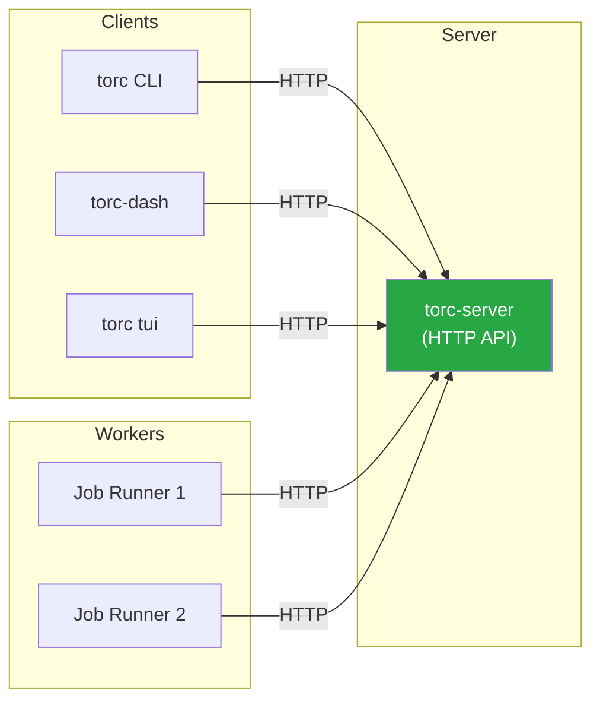
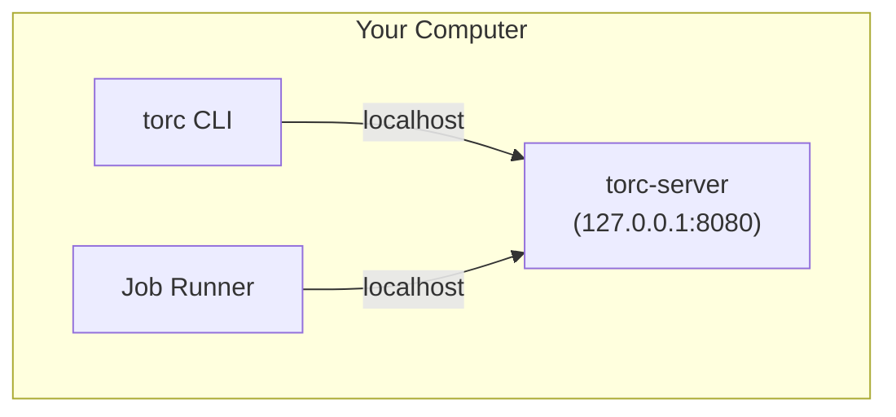
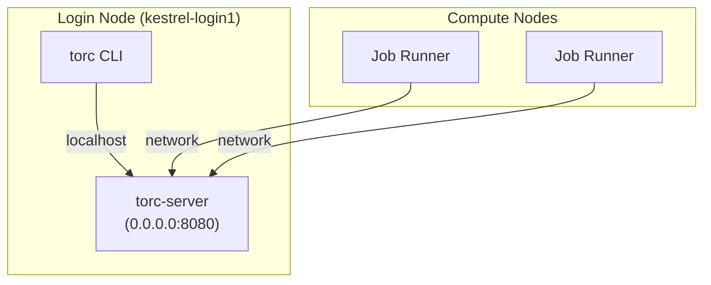
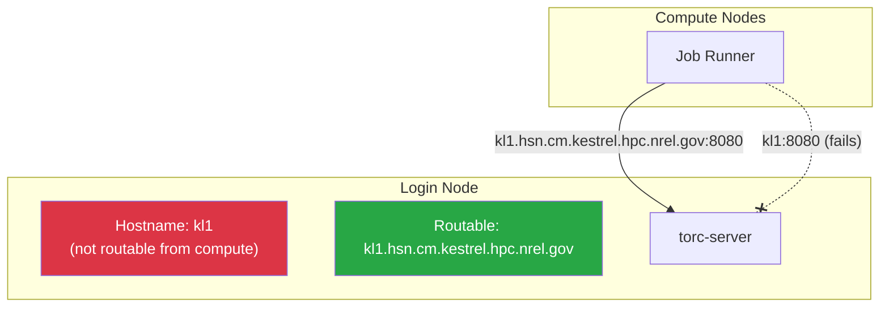
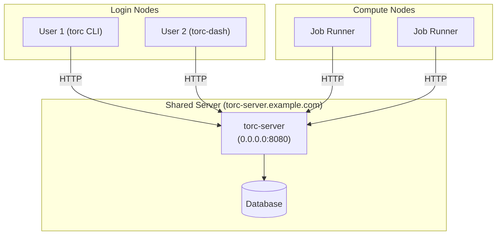

# Network Connectivity

Understanding how Torc components communicate is essential for proper deployment. This page explains
the network requirements for different scenarios.

## Component Communication

All Torc components communicate with the server via HTTP:



**Key insight:** Every component that needs to interact with workflows must be able to reach the
server's HTTP endpoint. The `--host` option on `torc-server` controls which network interfaces the
server listens on.

## Server Bind Address (`--host`)

The `--host` option determines which network interfaces the server accepts connections from:

| Value        | Meaning                | Use Case                       |
| ------------ | ---------------------- | ------------------------------ |
| `127.0.0.1`  | Localhost only         | Local development, security    |
| `0.0.0.0`    | All network interfaces | Remote workers need access     |
| `<IP>`       | Specific interface     | Multi-homed hosts, HPC nodes   |
| `<hostname>` | Specific hostname      | HPC with non-default hostnames |

---

## Scenario 1: Local Development

**Setup:** Everything runs on your laptop or workstation. No remote workers.



**Configuration:**

```bash
# Bind to localhost only (secure - not accessible from network)
torc-server run --host 127.0.0.1 --database torc.db
```

**Why localhost?** Binding to `127.0.0.1` ensures the server is only accessible from your machine.
This is the most secure option when you don't need remote access.

**Client connection:**

```bash
# Default works (localhost:8080)
torc workflows list

# Or explicit
export TORC_API_URL="http://localhost:8080/torc-service/v1"
```

---

## Scenario 2: HPC Login Node (Standard)

**Setup:** Server runs on a login node. Job runners execute on compute nodes via Slurm and need to
report results back to the server.



**Configuration:**

```bash
# Bind to all interfaces so compute nodes can reach the server
torc-server run --host 0.0.0.0 --database torc.db

# IMPORTANT: Enable authentication on shared systems
torc-server run --host 0.0.0.0 --database torc.db \
    --auth-file ~/.torc/htpasswd --require-auth
```

**Why 0.0.0.0?** Compute nodes are separate machines that need network access to the server. Binding
to `0.0.0.0` makes the server accessible on all network interfaces.

**Security consideration:** On HPC systems, other users on the same login node or network can
potentially access your server. Enable authentication with `--auth-file` and `--require-auth` to
prevent unauthorized access to your workflows.

**Client connection (from login node):**

```bash
export TORC_API_URL="http://localhost:8080/torc-service/v1"
```

**Worker connection (from compute nodes):** Workers automatically use the `TORC_API_URL` set when
the Slurm job was submitted. Torc handles this automatically.

---

## Scenario 3: HPC with Non-Routable Hostname

**Problem:** Some HPC systems have login nodes where the default hostname is not routable from
compute nodes. For example, on NREL's Kestrel cluster, login node `kl1` must be accessed as
`kl1.hsn.cm.kestrel.hpc.nrel.gov` from compute nodes.



**Configuration:**

```bash
# Bind to the routable hostname
torc-server run --host kl1.hsn.cm.kestrel.hpc.nrel.gov --database torc.db
```

**How to find the routable hostname:**

1. Check with your HPC administrators
2. Look for high-speed network (HSN) or InfiniBand hostnames
3. Try `hostname -f` or check `/etc/hosts`

**Verification:** From a compute node, test connectivity:

```bash
srun --pty curl -s http://kl1.hsn.cm.kestrel.hpc.nrel.gov:8080/torc-service/v1/workflows
```

---

## Scenario 4: Shared Server

**Setup:** A dedicated server runs `torc-server` persistently. Multiple users connect from login
nodes and submit jobs to Slurm.



**Server configuration:**

```bash
# On the shared server - enable auth for multi-user access
torc-server run --host 0.0.0.0 --port 8080 \
    --database /shared/torc/torc.db \
    --auth-file /shared/torc/htpasswd \
    --require-auth
```

**Client configuration (all users):**

```bash
export TORC_API_URL="http://torc-server.example.com:8080/torc-service/v1"
export TORC_USERNAME="myusername"
export TORC_PASSWORD="mypassword"
```

---

## Scenario 5: torc-dash Standalone Mode

**Setup:** `torc-dash --standalone` automatically starts a managed `torc-server`. The
`--server-host` option controls the server's bind address.

```bash
# Local development (server binds to 0.0.0.0 by default for external access)
torc-dash --standalone

# Restrict server to localhost only
torc-dash --standalone --server-host 127.0.0.1

# Bind to specific hostname (HPC with non-routable default hostname)
torc-dash --standalone --server-host kl1.hsn.cm.kestrel.hpc.nrel.gov
```

The dashboard always connects to the managed server locally, but external workers will use the
configured `--server-host` to reach the server.

---

## Troubleshooting

### "Connection refused" from compute nodes

The server might be bound to localhost only:

```bash
# Check what the server is bound to
netstat -tlnp | grep 8080

# If showing 127.0.0.1:8080, restart with:
torc-server run --host 0.0.0.0 ...
```

### "Name not resolved" from compute nodes

The hostname might not be routable:

```bash
# From a compute node, test resolution
srun --pty getent hosts <login-node-hostname>

# Try the fully-qualified or HSN hostname instead
torc-server run --host <routable-hostname> ...
```

### Workers can't reach server through firewall

Some HPC systems have firewalls between login and compute nodes. Check with your administrators
about allowed ports and networks.

### Port already in use

Another process is using the port:

```bash
# Find what's using the port
lsof -i :8080

# Use a different port
torc-server run --port 8081 ...

# Or use port 0 for auto-selection
torc-server run --port 0 ...
```

---

## Summary Table

| Scenario                    | `--host` Value        | Authentication    |
| --------------------------- | --------------------- | ----------------- |
| Local development           | `127.0.0.1`           | Optional          |
| HPC login node              | `0.0.0.0`             | Recommended       |
| HPC (non-routable hostname) | `<routable-hostname>` | Recommended       |
| Shared server               | `0.0.0.0`             | Required          |
| torc-dash standalone        | Via `--server-host`   | Depends on access |

## See Also

- [Authentication](../../specialized/admin/authentication.md) - Securing your server
- [Dashboard Deployment](../../specialized/tools/dashboard-deployment.md) - Web UI setup
- [Quick Start (HPC)](../../getting-started/quick-start-hpc.md) - HPC workflow tutorial
