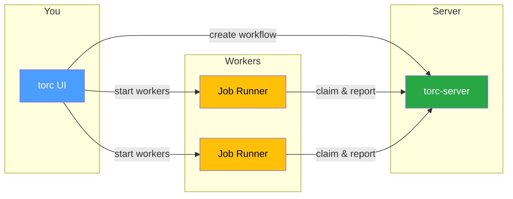

# Getting Started

Torc uses a client-server architecture where a central server manages workflow state and
coordination, while clients create workflows and job runners execute tasks on compute resources.

## How You Interact with Torc

Choose the interface that fits your workflow:

- **CLI** — Primary interface which provides access to all torc functionality
- **Dashboard** — Web UI ([torc-dash](../core/monitoring/dashboard.md)) for visual configuration and
  monitoring
- **TUI** — Terminal User Interface (`torc tui`) for visual monitoring in a terminal
- **AI Assistants** — Use [Claude Code](https://claude.ai/code) or GitHub Copilot to manage
  workflows through natural language. _"Create a workflow with 10 parallel jobs"_ or _"Why did job 5
  fail?"_
- **Spec Files** — YAML, KDL, or JSON5 files for version-controlled workflow definitions
- **Python/Julia APIs** — Libraries for programmatic workflow generation

All interfaces work with the same server — mix and match as needed.

## Architecture

1. **You** create workflows and start job runners via the UI
2. **Server** tracks workflow state and job dependencies
3. **Workers** poll the server, claim ready jobs, execute them, and report results

## Example Files

The repository includes ready-to-run workflow specifications in YAML, JSON5, and KDL formats:

| Example                                                                                                                       | Description                            | Tutorial                                                |
| ----------------------------------------------------------------------------------------------------------------------------- | -------------------------------------- | ------------------------------------------------------- |
| [diamond_workflow.yaml](https://github.com/NREL/torc/blob/main/examples/yaml/diamond_workflow.yaml)                           | Fan-out/fan-in pattern                 | [Diamond Workflow](../core/tutorials/diamond.md)        |
| [hundred_jobs_parameterized.yaml](https://github.com/NREL/torc/blob/main/examples/yaml/hundred_jobs_parameterized.yaml)       | 100 parallel jobs via parameterization | [Many Jobs](../core/tutorials/many-jobs.md)             |
| [hyperparameter_sweep.yaml](https://github.com/NREL/torc/blob/main/examples/yaml/hyperparameter_sweep.yaml)                   | ML grid search (3×3×2 = 18 jobs)       | [Advanced Params](../core/tutorials/advanced-params.md) |
| [multi_stage_barrier_pattern.yaml](https://github.com/NREL/torc/blob/main/examples/yaml/multi_stage_barrier_pattern.yaml)     | Efficient multi-stage workflow         | [Barriers](../core/tutorials/multi-stage-barrier.md)    |
| [resource_monitoring_demo.yaml](https://github.com/NREL/torc/blob/main/examples/yaml/resource_monitoring_demo.yaml)           | CPU/memory tracking                    | —                                                       |
| [workflow_actions_simple_slurm.yaml](https://github.com/NREL/torc/blob/main/examples/yaml/workflow_actions_simple_slurm.yaml) | Automated Slurm scheduling             | —                                                       |

**Browse all examples:**

- [YAML examples](https://github.com/NREL/torc/tree/main/examples/yaml)
- [JSON5 examples](https://github.com/NREL/torc/tree/main/examples/json)
- [KDL examples](https://github.com/NREL/torc/tree/main/examples/kdl)
- [Python examples](https://github.com/NREL/torc/tree/main/examples/python)

See the [examples README](https://github.com/NREL/torc/tree/main/examples) for the complete list.

## Choose Your Execution Mode

Torc supports three fundamentally different execution environments. Choose the one that matches your
use case:

### Local Execution

**Best for:** Development, testing, small-scale workflows on your workstation or a single server

- Jobs run directly on the machine where you start the job runner
- No scheduler needed — simple setup with `torc run`
- Resource management via local CPU/memory/GPU tracking
- **→ [Quick Start (Local)](quick-start-local.md)**

### HPC/Slurm

**Best for:** Large-scale computations on institutional HPC clusters

- Jobs submitted to Slurm scheduler for compute node allocation
- Automatic resource matching to partitions/QOS
- Built-in profiles for common HPC systems
- **→ [Quick Start (HPC/Slurm)](quick-start-hpc.md)**

### Remote Workers

**Best for:** Distributed execution across multiple machines you control via SSH

- Jobs distributed to remote workers over SSH
- No HPC scheduler required — you manage the machines
- Flexible heterogeneous resources (mix of CPU/GPU machines)
- **→ [Quick Start (Remote Workers)](quick-start-remote.md)**

---

**All three modes:**

- Share the same workflow specification format
- Use the same server API for coordination
- Support the same monitoring tools (CLI, TUI, Dashboard)
- Can be used together (e.g., develop locally, deploy to HPC)

Continue to the [Quick Start](./quick-start.md) guide to run your first workflow.
