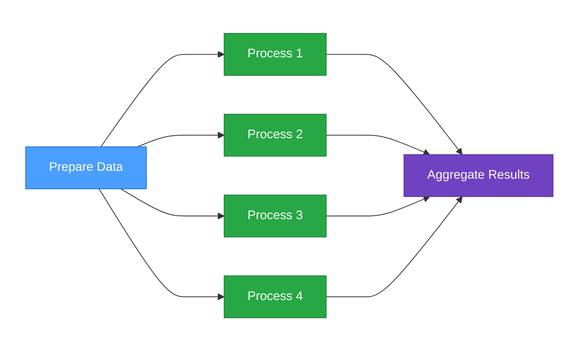

# Introduction

**Torc** is a distributed workflow orchestration system for managing computational pipelines ranging
from simple workflows needing to parallelize independent jobs to complex workflows with job
dependencies, mixed resource requirements, and multiple stages.

## Key Features

- **Declarative Workflow Definitions** — Define workflows in YAML, JSON, JSON5, or KDL
- **Job Parameterization** — Create parameter sweeps with simple syntax like `index: "1:100"` to
  expand one job definition into hundreds ([tutorial](./core/tutorials/simple-params.md))
- **Automatic Dependency Resolution** — Dependencies inferred from file and data relationships. No
  explicit `depends_on` declarations needed—Torc builds the dependency graph from your data flow
  ([tutorial](./core/tutorials/diamond.md))
- **Distributed Execution** — Run jobs across local machines, HPC clusters, and networked compute
  nodes
- **Resource Management** — Track CPU and memory usage across all jobs
- **Automatic Failure Recovery** — Detect OOM/timeout failures and retry with adjusted resources
- **Fault Tolerance** — Resume workflows after failures without losing progress
- **AI-assisted configuration and management** — Use AI tools like Claude Code and Copilot to
  configure workflows and diagnose problems

## Who Should Use Torc?

Torc is designed for:

- **HPC Users** who need to parallelize jobs across cluster resources
- **Computational Scientists** running parameter sweeps and simulations
- **Data Engineers** building complex data processing pipelines
- **ML/AI Researchers** managing training workflows and hyperparameter searches
- **Anyone** who needs reliable, resumable workflow orchestration

## Documentation Structure

This documentation is organized to help you find what you need quickly:

**Core Documentation** (for all users):

- **Getting Started** — Installation and local quick start
- **Core Concepts** — Architecture, job states, and dependencies
- **Working with Workflows** — Creating and managing workflows
- **Tutorials** — Step-by-step workflow patterns
- **Monitoring & Debugging** — TUI, reports, and troubleshooting
- **Reference** — CLI commands, formats, and configuration

**Specialized Topics** (below the separator in the sidebar):

- **HPC & Slurm** — Running on compute clusters
- **Fault Tolerance & Recovery** — Failure handlers, checkpointing, automatic recovery
- **Administration & Security** — Server deployment, authentication, access control
- **Design & Architecture** — Internal design for contributors

## Next Steps

- **New to Torc?** Start with [Quick Start (Local)](./getting-started/quick-start-local.md)
- **Want to understand how it works?** Read the
  [Architecture Overview](./core/concepts/architecture.md)
- **Ready to create workflows?** Jump to
  [Creating Workflows](./core/workflows/creating-workflows.md)
- **On an HPC cluster?** See [Quick Start (HPC)](./getting-started/quick-start-hpc.md)
