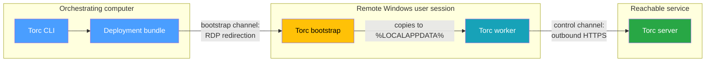
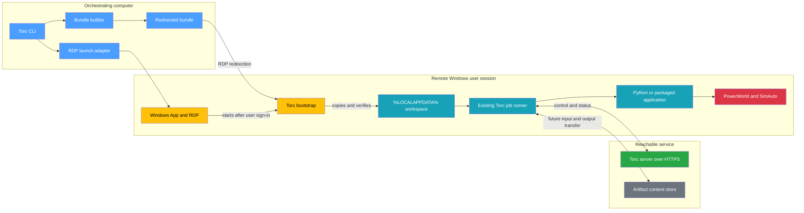
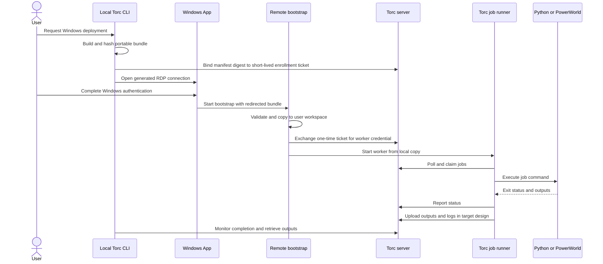

# RDP Bootstrap for Windows Workers

This document describes a proposed architecture for launching Torc workers on Windows machines that
expose Remote Desktop Protocol (RDP) but not SSH. For the currently supported remote-worker path,
see [Remote Workers](../remote/remote-workers.md).

## Overview

Use Microsoft Windows App and RDP as an authenticated bootstrap channel, not as Torc's long-running
control channel.

The orchestrating computer prepares a portable deployment bundle and opens an RDP connection. The
user completes the normal Windows sign-in. RDP starts the Torc bootstrap in that user's session, and
the bootstrap copies the bundle into the user's local profile before starting a normal Torc worker.
The worker then communicates with a reachable Torc server over HTTPS.



This approach is intended to require:

- no SSH server
- no administrator access
- no Windows service
- no machine-wide installation or `PATH` change
- one interactive Windows sign-in per deployment

The design deploys Torc and the workload. It does not install or license PowerWorld. PowerWorld must
already be installed and usable by the signed-in Windows user.

## Problem Statement

A user can open a remote Windows desktop through Windows App and run PowerWorld, but cannot depend
on any of the following:

- enabling OpenSSH Server or WinRM
- installing a system service
- writing to `Program Files`
- changing machine-wide policy or firewall rules
- receiving help from an administrator for every workflow

The orchestrating computer should prepare the work, initiate the existing Windows connection, and
observe the workflow. The user should only need to authenticate through Windows App.

An RDP connection alone does not automatically give a local process a general remote-execution API.
The design therefore depends on two standard RDP features:

1. **Drive or folder redirection** exposes a deployment bundle in the remote session
2. **Alternate shell or startup program** launches the bootstrap after sign-in

Microsoft documents these features independently. Whether Windows App makes the redirected bundle
available before starting an alternate shell must be proven on the target connection type.

### Current Torc Support

Torc can run jobs on Windows, but its current remote-worker lifecycle uses SSH.

| Capability                                                  | Status        |
| ----------------------------------------------------------- | ------------- |
| Windows job execution after `torc run` starts               | Supported     |
| Remote Windows worker launch over SSH and PowerShell        | Supported     |
| Portable `torc.exe` without machine-wide installation       | Supported     |
| Windows App and RDP launch                                  | Not supported |
| Workflow input and output content transfer                  | Not supported |
| Scoped credential for a newly bootstrapped worker           | Not supported |
| Detecting a worker that stopped without deactivating itself | Not supported |

The existing Windows job runner uses `cmd.exe /C`, so commands can invoke Python, native
executables, batch files, and COM-based applications. The missing part is securely placing and
starting the worker and its files on a machine that exposes RDP but not SSH.

## Design Goals

- Start a Torc worker in the remote user's Windows session without SSH or administrator access.
- Reuse the existing Torc server, scheduler, job runner, and Windows command execution.
- Stage `torc.exe`, scripts, configuration, and workflow inputs such as `.pwb` files.
- Run headless application automation, including PowerWorld SimAuto.
- Return logs, declared outputs, and bootstrap diagnostics to the orchestrating computer.
- Avoid storing a Windows password or reusable Torc password in the deployment bundle.
- Make repeated connection attempts safe and diagnosable.

### Non-goals

- Installing or licensing PowerWorld.
- Bypassing Group Policy, AppLocker, Windows Defender Application Control, or SmartScreen.
- Automating Windows login or storing the user's RDP password.
- Driving PowerWorld by clicking its graphical interface.
- Guaranteeing that work survives Windows logout, host reboot, or forced session termination.
- Supporting disconnected execution when the remote machine cannot reach a Torc server in the first
  release.

## Prerequisites

The design requires all of the following:

1. The user can sign in to the target through Windows App.
2. The local client can supply the connection settings the bootstrap needs. See
   [Client Capability Constraints](#client-capability-constraints).
3. The target permits the selected RDP startup mechanism.
4. The target permits local drive or folder redirection for the deployment bundle.
5. The signed-in user may execute `torc.exe` from `%LOCALAPPDATA%`.
6. The remote machine can make an outbound HTTPS connection to the Torc server, including through
   any required corporate proxy.
7. Required applications are installed and licensed for that Windows user.
8. Workload-specific architecture requirements match, such as 64-bit Python with 64-bit PowerWorld.

The sixth requirement is important. RDP does not give the remote Torc worker a network route back to
a server running only on an unreachable laptop address. The Torc server must be on a network address
that the remote Windows machine can reach, such as an organization-hosted endpoint. Torc's HTTP
client does not implement explicit proxy configuration, so a network that requires a proxy must be
validated during the feasibility probe rather than assumed to work.

### Client Capability Constraints

The two features this design depends on are not uniformly available across clients, and the
available client determines whether the launch can be generated at all.

| Launch mechanism             | Availability                                                                                                                                                   |
| ---------------------------- | -------------------------------------------------------------------------------------------------------------------------------------------------------------- |
| Generated `.rdp` file        | Windows (MSTSC) and legacy macOS client via `File > Import`. Windows App for macOS documents "downloading a `.rdp` file for connection" as a known limitation. |
| `rdp://` URI with attributes | macOS, iOS, and Android clients only. Supports `alternate shell`, `shell working directory`, and `drivestoredirect`.                                           |
| `ms-rd:` URI                 | Windows Desktop client only, and the only documented command is `subscribe`. It cannot carry connection properties.                                            |
| `ms-avd:` URI                | Windows App for Windows, for Azure Virtual Desktop resources.                                                                                                  |

Two consequences follow. First, on a Windows orchestrating computer there is no URI path that can
carry a startup program, so the launch must be a generated `.rdp` file. Second, `drivestoredirect`
has exactly one supported value on the macOS, iOS, and Android clients: `*`, meaning all drives.
Scoping redirection to only the bundle directory is therefore not possible on those clients, and the
realistic outcome is exposing every local drive to the remote session for the duration of the
bootstrap.

Session termination semantics also differ from a normal desktop. Microsoft documents that a session
started with a program specified under "Start the following program on connection" terminates when
that program and every process it spawned have exited. Whether the bootstrap should exit after
handoff or remain as a supervisor depends on which behavior the target exhibits, and the two choices
have opposite consequences: exiting may log the session off and kill the worker, while remaining
pins a session open that is no longer needed. The [Feasibility Probe](#feasibility-probe) must
resolve this before the bootstrap's exit behavior is fixed.

## Architecture

### Component Overview



The channels have separate responsibilities:

| Channel   | Carries                                                  | Transport                                             |
| --------- | -------------------------------------------------------- | ----------------------------------------------------- |
| Bootstrap | Windows authentication, bundle delivery, process startup | Windows App and RDP                                   |
| Control   | Job claiming, status, results                            | Outbound HTTPS from the worker                        |
| Artifact  | Input and output bytes                                   | RDP redirection in the prototype, then outbound HTTPS |

Keeping these responsibilities separate prevents Torc from treating an interactive RDP session as a
reliable message transport.

### Data Flow



RDP is no longer needed after the worker has copied its inputs and connected to the server, unless
the initial artifact-return implementation still depends on the redirected folder.

### Deployment Bundle

An illustrative bundle is:

```text
torc-rdp-deployment/
├── manifest.json
├── enrollment.ticket
├── torc.exe
├── ca/
│   └── internal-root.pem
├── inputs/
│   └── study.pwb
├── scripts/
│   └── run_powerworld.py
└── wheels/
```

`ca/` carries a trust anchor only when the Torc server uses an internal certificate authority.
`wheels/` carries a wheelhouse only when the workload builds a deployment-local virtual environment.
Outputs are written under the deployment directory at runtime rather than shipped in the bundle.

The bootstrap copies this bundle to a user-owned directory:

```text
%LOCALAPPDATA%\Torc\deployments\<deployment-id>\
```

It must not execute jobs directly from `\\tsclient` or another redirected path. Redirection can be
slow, can disappear when the RDP session disconnects, and does not provide suitable filesystem
semantics for a durable worker workspace.

A manifest could contain:

```json
{
  "schema_version": 1,
  "deployment_id": "0195c1f8-example",
  "workflow_id": 42,
  "server_url": "https://torc.example.org",
  "tls_ca_cert": "ca/internal-root.pem",
  "torc_version": "0.40.0",
  "runner": {
    "poll_interval": 5.0,
    "max_parallel_jobs": 1
  },
  "inputs": [
    {
      "source": "inputs/study.pwb",
      "target": "inputs/study.pwb",
      "size_bytes": 4823192,
      "sha256": "..."
    }
  ]
}
```

The `runner` keys mirror existing `torc run` options rather than introducing new names.

`torc_version` records which binary the bundle builder staged, so a bootstrap log identifies it
without hashing the executable. The API contract version is deliberately not a manifest field: the
client already compiles in `HTTP_API_VERSION` and compares it against the server's `/version`
response, so a copy in the manifest could disagree with the binary beside it and would be the less
trustworthy of the two. The bootstrap should instead run that existing check before starting the
worker, so an incompatible bundled binary fails before the enrollment ticket is spent.

`tls_ca_cert` names a trust anchor inside the bundle for servers using an internal certificate
authority.

Each payload entry includes its size and digest. When it issues the ticket, the server records the
digest of the canonical manifest, avoiding a self-referential digest inside the manifest. The
bootstrap must present the same digest when it exchanges the ticket.

The manifest contains no Windows credentials. `enrollment.ticket` is a single-use secret with a
short expiration and is deleted after exchange. It authorizes only one deployment and workflow.

## Component Design

### Bootstrap Command

The bootstrap should be a subcommand of the portable Torc executable unless the feasibility probe
shows that Windows App requires a smaller dedicated executable:

```console
torc.exe internal rdp-bootstrap --manifest manifest.json
```

The command is internal because users should start it through the local deployment command, not
construct bootstrap arguments themselves.

The bootstrap performs these steps:

1. Resolve the redirected bundle and reject paths outside it.
2. Validate the manifest schema, deployment identifier, sizes, and SHA-256 digests.
3. Acquire a deployment-specific lock so reconnecting cannot start a second worker.
4. Copy into a temporary directory under `%LOCALAPPDATA%\Torc\deployments`.
5. Atomically rename the temporary directory to the final deployment directory.
6. Confirm the copied binary's API contract version is compatible with the server, so an
   incompatible bundle fails before the one-time ticket is spent.
7. Exchange the one-time enrollment ticket over TLS.
8. Delete the ticket and restrict the local credential file to the current user.
9. Start the copied `torc.exe` with the deployment directory as its working directory. Job commands
   inherit that directory, which is what makes deployment-relative paths resolve.
10. Record machine-readable bootstrap state and human-readable logs.
11. Exit, or remain resident as a small supervisor, according to what the feasibility probe
    established about session termination on the target. These are not interchangeable: if the
    target ends the session when the startup program exits, exiting kills the worker.

The copied worker, rather than the process on the redirected drive, performs all workflow work.

### RDP Launch Adapter

The local adapter generates a connection from an existing user-approved connection profile. It does
not store or process the Windows password.

The generated connection needs the equivalent of:

- the target address or workspace resource
- redirected access to the deployment bundle
- an alternate shell or startup program pointing to the bootstrap
- a working directory containing the bundle

The exact `.rdp` properties or `rdp://` URI are adapter-specific. They are deliberately not fixed by
this design until the feasibility probe confirms how the current Windows App exposes these features
on each local operating system. The per-client availability of these features is summarized in
[Client Capability Constraints](#client-capability-constraints).

Microsoft documents relevant properties in:

- [Supported RDP properties](https://learn.microsoft.com/en-us/azure/virtual-desktop/rdp-properties)
- [Remote Desktop client URI schemes](https://learn.microsoft.com/en-us/windows-server/remote/remote-desktop-services/clients/remote-desktop-uri)

A workspace-feed connection for Azure Virtual Desktop or Windows 365 may not permit the client to
supply custom RDP properties. Host-pool policy can also override redirection or startup behavior.
These cases must fail with a specific diagnostic rather than silently opening a normal desktop.

If alternate-shell startup is blocked but redirection works, a limited fallback may open the desktop
and ask the user to launch one generated `Start Torc` file from the redirected folder. This remains
admin-free and requires no permanent setup, but it does not meet the one-sign-in automation goal.

### Control and Authentication

The current worker accepts Basic Authentication or a browser cookie, and it derives the API username
from the Windows account. That is insufficient for unattended bootstrap because:

- the Windows username may differ from the Torc workflow owner
- a reusable password must not be written into an RDP file, command line, or bundle
- a browser session cookie should not be copied to another machine
- the current SSH launcher does not provision a remote worker credential

This design therefore depends on a scoped worker credential that the bootstrap can obtain without
carrying a reusable secret. That capability is not an RDP feature. Torc's server authorizes by
username string, has no token store, and does not enforce scopes on authorization decisions, so
introducing a second principal type affects every endpoint. It is specified separately in
[Worker Enrollment](./worker-enrollment.md) and is a prerequisite for the connected worker described
in [Implementation Details](#implementation-details).

What this design requires from that specification:

- a short-lived, single-use ticket that the local command can bind to one workflow and deployment
- an exchange that yields a revocable credential limited to runner operations
- expiration tied to the workflow or deployment lifetime
- a worker identity separate from the remote operating-system username
- audit events recording both the Torc principal that authorized the deployment and the reported
  Windows host and user identity

#### Worker Liveness

Separately from authentication, the server has no way to observe that a worker has stopped. A
compute node is marked active at registration and inactive only on graceful shutdown, so a worker
killed by Windows logout, host reboot, or forced session termination remains active indefinitely and
its running jobs are never reaped. Orphan detection does not close this gap: its non-Slurm path
returns early whenever the workflow has any active compute node, so one stale node also suppresses
detection for every other worker in that workflow.

This matters most for RDP workers because session survival is policy-dependent and termination is
expected rather than exceptional. It is not RDP-specific, though: local and SSH workers have the
same gap today.

Closing the gap requires a heartbeat that active workers report on their existing poll cadence, and
a staleness branch in orphan detection that treats a node whose heartbeat has expired as gone. A
heartbeat detects a stopped worker; it does not keep one alive. Keeping a user-session process alive
across disconnect or logout remains outside Torc's control.

### Input and Output Files

Torc currently records file paths and modification metadata. It does not upload or download file
contents. Workflow initialization can also inspect declared input paths on the computer running the
manager. A portable Windows deployment therefore needs explicit content staging and path rules.

#### Prototype

For the session-bound prototype:

1. The bundle contains all required inputs.
2. Workflow commands use deployment-relative paths.
3. The bootstrap launches the worker with the deployment directory as its current directory.
4. Outputs and logs are copied back through the redirected folder before the RDP session closes.

This is enough to test a small workflow but makes execution session-bound.

#### Target

The target design adds an HTTPS artifact-content API:

- Inputs are uploaded once and addressed by digest.
- The bootstrap downloads required inputs into the deployment workspace.
- Workers upload declared outputs after successful job completion.
- The server verifies size and digest before marking an upload complete.
- Partial transfers can resume.
- Retention and access follow workflow authorization.

Logical, deployment-relative paths must be separated from host filesystem paths. A local path such
as `./study.pwb` and a Windows path such as `%LOCALAPPDATA%\Torc\deployments\<id>\inputs\study.pwb`
may identify the same logical workflow input without pretending they are the same host path.

### Running Python

The workflow command runs in the copied deployment directory. If Python is already available to the
user, a job can use:

```yaml
jobs:
  - name: process case
    command: py -3 scripts\run_powerworld.py inputs\study.pwb outputs\result.csv
```

The deployment must not assume that Python or packages are installed machine-wide. Supported
packaging strategies should be evaluated in this order:

1. Use an existing compatible Python installation and validate imports before starting the worker.
2. Bundle a wheelhouse and create a deployment-local virtual environment without network access.
3. Package the application as a signed standalone Windows executable.
4. Bundle a compatible user-mode Python runtime if licensing and package compatibility allow it.

A virtual environment built on another operating system is not portable to Windows. The local Torc
command must either build Windows artifacts on Windows or consume artifacts produced by a Windows
build pipeline.

### Running PowerWorld

A `.pwb` file is a PowerWorld case, not the PowerWorld application. The target Windows machine must
already have a compatible PowerWorld version, license, and COM registration. Automated Python work
should use PowerWorld's supported SimAuto COM interface rather than graphical UI automation.

The Python workload typically:

1. creates the `pwrworld.SimulatorAuto` COM object through `pywin32`
2. opens the staged `.pwb` case
3. invokes SimAuto operations
4. checks every returned error string
5. saves declared result files under the deployment output directory
6. exits nonzero when PowerWorld reports an error

Torc then treats the script like any other command and records its exit status and standard output.
The initial PowerWorld worker should default to one concurrent job because application licensing and
COM process isolation may not permit safe parallel instances. Parallelism can be enabled only after
a targeted test confirms it for the installed version and license.

PowerWorld references:

- [Simulator Automation Server](https://www.powerworld.com/WebHelp/Content/MainDocumentation_HTML/Simulator_Automation_Server.htm)
- [Connecting to the Simulator Automation Server](https://www.powerworld.com/WebHelp/Content/MainDocumentation_HTML/Connecting_to_Simulator_Automation_Server.htm)
- [Example SimAuto files](https://www.powerworld.com/knowledge-base/example-simauto-files)

## Failure Handling

The local command and bootstrap should report distinct deployment states, so a failure names the
stage that failed rather than a generic error:

| State               | Failure mode                                                     |
| ------------------- | ---------------------------------------------------------------- |
| `Prepared`          | Bundle creation fails or an input changes during hashing         |
| `Session requested` | Windows App cannot open the generated connection                 |
| `Session started`   | The user cancels authentication or policy rejects the connection |
| `Bundle visible`    | Redirection is disabled or not mounted before startup            |
| `Bootstrapped`      | Windows blocks the executable or the local copy fails            |
| `Worker enrolled`   | The ticket expires or TLS validation fails                       |
| `Worker connected`  | The server is unreachable from the Windows machine               |
| `Running`           | Python, PowerWorld, or a job command fails                       |
| `Collecting`        | Output upload or redirected copy fails                           |
| `Complete`          | All declared outputs and final status are available              |

A deployment identifier and local state file make startup idempotent. Reopening the generated
connection must observe or reconnect to the existing deployment rather than launch duplicate
workers.

Disconnect, logout, and reboot are different events:

| Event      | Effect on the worker                                                                         |
| ---------- | -------------------------------------------------------------------------------------------- |
| Disconnect | May leave the user session and worker running, depending on host policy                      |
| Logout     | Terminates user-session processes unless an administrator-managed mechanism keeps them alive |
| Reboot     | Terminates the worker                                                                        |

The first release must state that session survival is policy-dependent. It must not imply
service-like reliability from a user process. Because termination is expected rather than
exceptional, the server needs to detect it; see [Worker Liveness](#worker-liveness).

## Security Model

- Windows App remains responsible for authenticating the Windows user.
- Torc never records the Windows password.
- Torc server traffic uses verified TLS.
- Enrollment tickets are random, single-use, narrowly scoped, and short-lived.
- Reusable Basic Authentication passwords and browser cookies are not copied into bundles.
- Every payload file has a size and digest in the manifest.
- The bootstrap rejects absolute targets, parent traversal, links, and writes outside its deployment
  directory.
- The worker runs with the signed-in user's permissions and cannot elevate.
- Secrets are excluded from job command arguments and normal logs.
- Cleanup removes tickets and worker credentials while retaining only policy-approved logs and
  outputs.
- Code signing is recommended because organization policy may reject unsigned executables.

RDP redirection exposes local files to the remote session. The adapter should redirect only the
bundle location, but `drivestoredirect` accepts only `*` on the macOS, iOS, and Android clients, so
on those clients every local drive is exposed for the duration of the bootstrap. Treat that as a
known cost of the redirection-based artifact channel and a reason to reach the target design, where
the worker downloads inputs over HTTPS instead.

The bootstrap must not place a credential in its own environment. Job subprocesses inherit the
worker's environment, and `torc run` reads `TORC_PASSWORD` from it, so any secret exported for the
bootstrap's own use would reach every job command.

If the Torc server presents a certificate from an internal certificate authority, the manifest must
carry the trust anchor the worker should use. An enrolled worker must never disable certificate
verification.

## Module Boundaries

| Module                   | Responsibility                                                                                  |
| ------------------------ | ----------------------------------------------------------------------------------------------- |
| RDP deployment command   | Orchestrates preparation, launch, monitoring, and collection                                    |
| Bundle builder           | Produces an immutable manifest and content-addressed bundle                                     |
| RDP launch adapter       | Translates a connection profile into Windows App invocation data                                |
| Bootstrap command        | Validates, copies, enrolls, and starts a local worker                                           |
| Enrollment service       | Issues and exchanges scoped worker credentials. See [Worker Enrollment](./worker-enrollment.md) |
| Artifact-content service | Transfers input and output bytes over HTTPS                                                     |
| Existing job runner      | Claims and executes jobs after bootstrap                                                        |
| Application adapter      | Remains a workload-owned script or executable, such as a SimAuto Python script                  |

RDP and PowerWorld details must remain adapters around the existing runner. The job runner should
not contain RDP connection logic or PowerWorld-specific behavior.

An illustrative future command is:

```console
torc remote rdp run <workflow-id> --connection <profile> --include inputs/study.pwb
```

The command name and flags are not accepted interface design yet. They require a separate CLI review
after the feasibility probe determines whether a connection is represented by a host, `.rdp` file,
URI, Azure Virtual Desktop resource, or Windows 365 resource. Note that `torc remote` currently
means SSH and is hidden, so it would need to become transport-neutral first.

### Affected Implementation Files

The seams this design would extend or depend on:

| File                                                     | Relevance                                                 |
| -------------------------------------------------------- | --------------------------------------------------------- |
| `src/client/commands/remote.rs`                          | SSH worker lifecycle, the precedent for a new transport   |
| `src/client/remote/ssh.rs`, `src/client/remote/shell.rs` | Transport and Windows PowerShell launching                |
| `src/run_jobs_cmd.rs`                                    | Worker startup, authentication, and TLS options           |
| `src/client/job_runner.rs`                               | Compute node registration and deactivation                |
| `src/client/async_cli_command.rs`                        | Job command execution and environment inheritance         |
| `src/client/utils.rs`                                    | `shell_command()` selects `cmd.exe /C` on Windows         |
| `src/client/workflow_manager.rs`                         | Local input-path validation at initialization             |
| `src/client/commands/orphan_detection.rs`                | Reaping jobs whose worker is gone                         |
| `src/client/version_check.rs`                            | Client/server API contract check the bootstrap should run |

## Feasibility Probe

Before any Torc code changes, build the smallest signed or locally trusted Windows executable that
records its environment and copies one file. Do not modify the Torc server or job runner to run this
probe.

Verify, on every intended Windows App and host combination:

1. The orchestrating computer can open a generated `.rdp` file or supported URI.
2. The target honors a client-selected alternate shell or startup program.
3. Local folder or drive redirection is enabled.
4. The redirected bundle is visible before the startup program runs.
5. Windows permits the bootstrap to execute from the redirected location.
6. The bootstrap can copy itself and inputs into `%LOCALAPPDATA%`.
7. A copied child process can continue after RDP disconnect.
8. The session does not terminate when the bootstrap process exits, or, if it does, a supervisor
   that stays resident keeps the worker running.
9. The child can reach the intended Torc server over HTTPS, through any required proxy.
10. PowerWorld SimAuto can open and save a test case in that user session.
11. A result can return to the orchestrating computer.

If checks 2 through 5 fail, fully automatic bootstrap through stock RDP is not feasible under the
stated constraints. The choices are the one-click in-session fallback or an IT-provisioned launch
channel.

The probe must also record the deployment environment, because the adapter design depends on it: the
local operating systems and Windows App versions that must launch the connection, whether the target
is a direct remote PC, a Remote Desktop Services resource, Azure Virtual Desktop, or Windows 365,
and whether users can open a generated `.rdp` file or only a centrally managed workspace feed.

## Implementation Details

Three groups of work, ordered by what each depends on rather than by schedule.

### Session-Bound Prototype

Depends on a successful feasibility probe.

- Add bundle creation and validation.
- Add the internal Windows bootstrap command.
- Reuse the existing `torc run` worker and job execution.
- Keep the RDP session available until logs and outputs copy back through redirection.
- Support relative input and output paths inside one deployment workspace.
- Provide exact diagnostics for policy, startup, copy, process, and connectivity failures.

This proves execution without first designing a general artifact service. It authenticates with an
htpasswd account over TLS, which the server already supports, so the transport is realistic even
though enrollment is not yet in place. The bundle must not carry that password; supply it out of
band for the prototype. Session-bound artifact return makes this unsuitable for production use.

### Connected Worker

Depends on the session-bound prototype and on [Worker Enrollment](./worker-enrollment.md).

- Consume worker enrollment for one-time tickets and workflow-scoped credentials.
- Add HTTPS input download and output upload.
- Stop depending on RDP redirection after bootstrap.
- Add cleanup and credential revocation.

A worker heartbeat and a staleness branch in orphan detection also belong here, so a worker killed
by logout, reboot, or session termination is detected and its running jobs are reaped. That gap
affects local and SSH workers too, so it does not depend on anything in this design and can land
independently.

### Production Readiness

Depends on the connected worker.

- Add adapters for validated Windows App connection types.
- Add signed Windows release artifacts.
- Add resume and reconnect behavior.
- Add application capability declarations if heterogeneous workers need routing.
- Add explicit PowerWorld examples and an end-to-end integration test in a licensed environment.

## Alternatives Considered

| Alternative                                                  | Why rejected                                                                                 |
| ------------------------------------------------------------ | -------------------------------------------------------------------------------------------- |
| OpenSSH Server                                               | Torc's current remote path, but commonly disabled and may require administrator or IT action |
| WinRM or PowerShell Remoting                                 | Usually requires listener, policy, firewall, and credential configuration                    |
| Windows service                                              | Reliable, but installation normally requires administrator access                            |
| Scheduled task                                               | Depends on host policy and task configuration, so not a universal zero-setup channel         |
| Per-user logon persistence (`HKCU` autorun or per-user task) | See below                                                                                    |
| GUI click automation                                         | Fragile, difficult to observe, and unsuitable for unattended correctness                     |
| Execute from the redirected drive                            | Session-dependent and unsuitable for durable worker state                                    |
| Store a reusable password in the bundle                      | Exposes a broad credential on two machines and in copied files                               |

Per-user logon persistence deserves its own note because it appears attractive. It would survive
logout and reboot without administrator access, but it writes machine-persistent state on behalf of
a disposable per-workflow deployment, requires storing a durable server URL and credential to be
useful, and leaves a worker starting at every logon if cleanup ever fails. Session survival is an
explicit non-goal, so this trades a lasting footprint for a benefit this design does not seek.

The chosen approach is not policy-independent either. "Start a program on connection" policy and the
server-side `fInheritInitialProgram` setting can override or block a client-specified startup
program, and blocked `alternate shell` startup is a commonly reported outcome on recent Windows
Server releases. The advantage over a scheduled task is that RDP startup leaves nothing behind, not
that it is more reliably permitted.

## Acceptance Criteria

The initial supported release should not be declared complete until it demonstrates all of the
following on a documented connection type:

- A standard user launches a Windows worker with one RDP sign-in and no administrator action.
- Torc, a Python or packaged script, and a `.pwb` input are staged into the user profile.
- A SimAuto smoke workflow completes with one job and returns a declared output.
- No Windows password, reusable Torc password, or browser cookie appears in the bundle, process
  arguments, or logs.
- Reopening the connection does not launch a duplicate worker for the same deployment. Two
  deployments for one workflow still produce two workers; that is out of scope here.
- A worker terminated by closing the session is detected as gone, and its running jobs are reaped
  rather than left running forever.
- Policy blocks, unreachable server, expired ticket, executable block, and PowerWorld failure
  produce distinct actionable errors.
- Bundle and output digests are checked.
- The tested Windows App version, client operating system, target type, host policy, PowerWorld
  version, Python architecture, and disconnect behavior are recorded.

## Limitations

1. **Session survival is policy-dependent**: A worker is a user-session process. Disconnect behavior
   varies by host policy, and logout or reboot terminates it. This design cannot offer service-like
   reliability; the heartbeat detects termination rather than preventing it.
2. **Redirection scope is all-or-nothing on some clients**: `drivestoredirect` accepts only `*` on
   the macOS, iOS, and Android clients, so the prototype's artifact channel exposes every local
   drive for the duration of the bootstrap.
3. **Startup automation is not guaranteed**: Group Policy and `fInheritInitialProgram` can override
   or block a client-specified startup program. The fallback is a manual in-session launch, which
   does not meet the one-sign-in goal.
4. **One concurrent PowerWorld job by default**: Application licensing and COM process isolation may
   not permit safe parallel SimAuto instances. Parallelism requires a targeted test against the
   installed version and license.
5. **Prototype execution is session-bound**: Until the artifact-content API exists, outputs return
   through the redirected folder, so the RDP session must stay open until collection completes.
6. **Workload sizing and retention are undetermined**: Typical `.pwb` input and result sizes drive
   the artifact channel's transfer and resume requirements, and retention and access rules for case
   files and result artifacts are set by policy outside Torc. Both must be established with the
   workload owner before the target design is fixed.

For workloads that need guaranteed session survival, an IT-provisioned launch channel or a Windows
service remains the appropriate mechanism, at the cost of administrator involvement.
