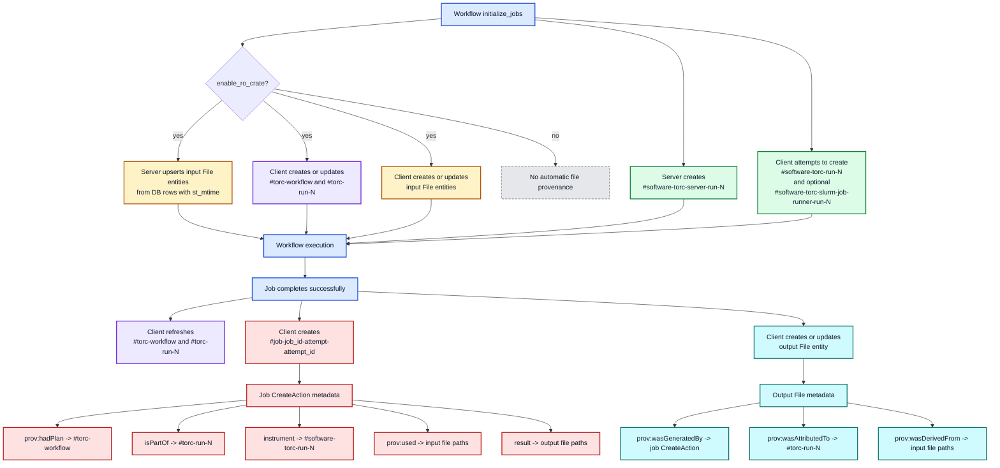

# RO-Crate Generation Design

This page describes how Torc creates and updates automatic RO-Crate provenance entities in the
current branch.

## Current Model

The current branch uses a PROV-shaped model introduced in commit `c0d53b98`
(`AD-324: Switch RO-Crate generation to PROV model`).

The important identity rules are:

- Workflow plan entity: one per workflow, `#torc-workflow`
- Workflow run entity: one per run, `#torc-run-{run_id}`
- Torc software entities: one per run, `#software-{binary_name}-run-{run_id}`
- Job execution entities: one per job attempt, `#job-{job_id}-attempt-{attempt_id}`
- File entities: one per file record/path, updated in place across runs

That last point is why `build_file_entity()` does not take `run_id`. Plain file entities are not
modeled as run-scoped records. Run-scoped provenance is attached through relationships:

- Output files link to the workflow run with `prov:wasAttributedTo`
- Output files link to the producing job with `prov:wasGeneratedBy`
- Job `CreateAction` entities link to the run with `isPartOf`
- Job `CreateAction` entities link to software agents with `instrument` and `prov:wasAssociatedWith`

If `run_id` were written directly into the base file entity metadata again, it would mix a stable
file identity with run-specific state. The current code instead keeps file identity stable and
updates the same file entity as a file moves from "input known at initialization" to "output with
provenance after job completion".

This design is also consistent with the multi-run behavior covered by
`test_auto_ro_crate_second_run_replaces_entities`: file entities are replaced in place, while
software and job execution entities accumulate across runs and attempts.

## Entity Creation Flow

## What Gets Created

### Torc binaries

- The server always creates `#software-torc-server-run-{run_id}` during `initialize_jobs()`
- The client attempts to create run-scoped software entities for `torc` and, on Linux,
  `torc-slurm-job-runner`
- Client-side software entities are skipped when the corresponding binary cannot be found next to
  the current executable or on `PATH`
- These are `SoftwareApplication` plus `prov:SoftwareAgent`

### Jobs

- The client creates one `CreateAction` per successful job completion
- The entity id is `#job-{job_id}-attempt-{attempt_id}`
- The job entity is the main join point between inputs, outputs, workflow run, and software agents

### Input files

- Input files are detected by `st_mtime IS NOT NULL`
- During initialization, both the server and the client currently upsert the same input file entity
- The entity is keyed by workflow and `file_id`, with `entity_id = file.path`
- Input file entities are expected to exist before jobs run, but the code does not rely on them
  being create-only; it is intentionally upsert-based

### Output files

- Output file entities are created or replaced after a job succeeds and the file record has been
  refreshed
- If a file already had an entity from initialization or a prior run, the same DB row is updated
  rather than creating a new file entity for each run
- Run-specific provenance is recorded in the metadata relationships, not by giving the file entity a
  run-specific identity

## Important Asymmetries

- Software entities are run-scoped and accumulate across runs
- Job `CreateAction` entities are attempt-scoped and accumulate across attempts
- File entities are file-scoped and are replaced in place across runs

These asymmetries are intentional and match `tests/test_auto_ro_crate.rs`, especially
`test_auto_ro_crate_second_run_replaces_entities`, which expects:

- file entity count to stay stable across runs
- software entity count to grow across runs
- output file provenance to point at the newer `#torc-run-{run_id}`

## Current Gap

The current code creates and refreshes `#torc-run-{run_id}`, but it does not appear to write
`endTime` automatically when the workflow completes. The helper supports preserving an existing
`endTime`, yet the normal workflow execution path does not seem to set it.

For release purposes, the diagram above reflects the implemented behavior, not the idealized
behavior. In particular:

- Input file creation is implemented as upsert, not create-only
- Output file provenance is refreshed on successful job completion
- Workflow completion does not currently finalize the run entity with `endTime`
