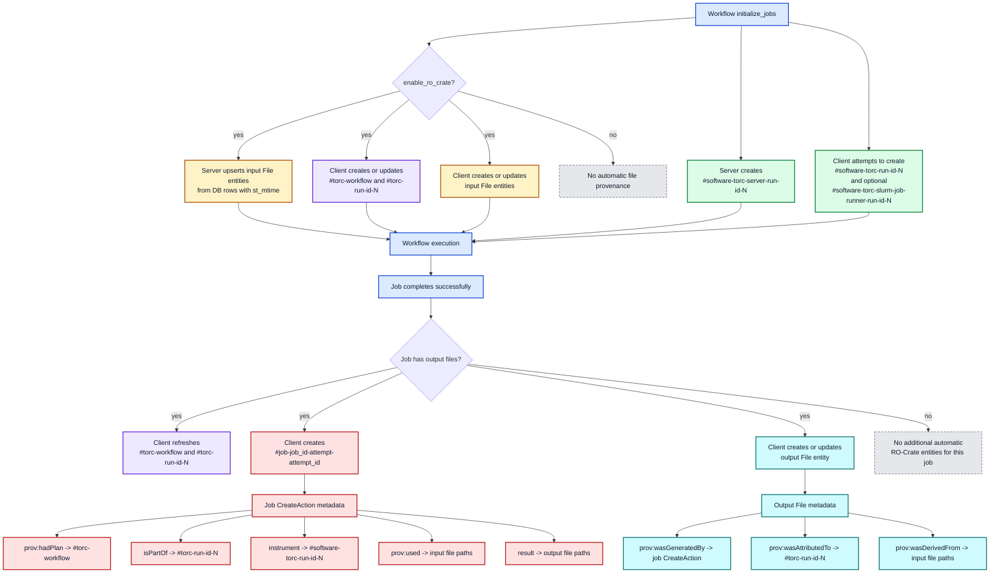

# RO-Crate Generation Design

This page describes how Torc creates and updates automatic RO-Crate provenance entities in the
current branch.

## Current Model

The important identity rules are:

- Workflow plan entity: one per workflow, `#torc-workflow`
- Workflow run entity: one per run, `#torc-run-id-{run_id}`
- Torc software entities: one per run, `#software-{binary_name}-run-id-{run_id}`
- Job execution entities: one per job attempt, `#job-{job_id}-attempt-{attempt_id}`
- File entities: one per file record/path, updated in place across runs

That last point is why `build_file_entity()` does not take `run_id`. Plain file entities are not
modeled as run-scoped records. Run-scoped provenance is attached through relationships:

- Output files link to the workflow run with `prov:wasAttributedTo`
- Output files link to the producing job with `prov:wasGeneratedBy`
- Job `CreateAction` entities link to the run with `isPartOf`
- Job `CreateAction` entities link to software agents with `instrument` and `prov:wasAssociatedWith`

If `run_id` were written directly into the base file entity metadata again, it would mix a stable
file identity with run-specific state. The current code instead keeps file identity stable and
updates the same file entity as a file moves from "input known at initialization" to "output with
provenance after job completion".

This design is also consistent with the multi-run behavior covered by
`test_auto_ro_crate_second_run_replaces_entities`: file entities are replaced in place, while
software and job execution entities accumulate across runs and attempts.

## Entity Creation Flow

## What Gets Created

### Torc binaries

- The server always creates `#software-torc-server-run-id-{run_id}` during `initialize_jobs()`
- The client attempts to create run-scoped software entities for `torc` and, on Linux,
  `torc-slurm-job-runner`
- Client-side software entities are skipped when the corresponding binary cannot be found next to
  the current executable or on `PATH`
- These are `SoftwareApplication` plus `prov:SoftwareAgent`

### Jobs

- The client creates one `CreateAction` per successful job completion **that has at least one output
  file**
- The entity id is `#job-{job_id}-attempt-{attempt_id}`
- Jobs with no output files currently do not emit an automatic `CreateAction`
- When present, the job entity is the main join point between inputs, outputs, workflow run, and
  software agents

### Input files

- Input files are detected by `st_mtime IS NOT NULL`
- During initialization, both the server and the client currently upsert the same input file entity
- The entity is keyed by workflow and `file_id`, with `entity_id = file.path` by default
- When a `FileSpec` carries a user-supplied `identifier`, `create_files` pre-creates the entity row
  at workflow-creation time with `entity_id = identifier` and `metadata["@id"] = identifier`. The
  server's init-time upsert preserves the `entity_id` column even though it rewrites
  `metadata["@id"]` back to `file.path`. Export then uses `entity_id` as the authoritative `@id`
  (overwriting whatever ends up in `metadata["@id"]`), so the user identifier survives regardless of
  whether the client-side `create_ro_crate_entity_for_file` ran afterward — important because the
  async-init path returns before the client-side rebuild can re-write `metadata["@id"]`.
- Export also builds a path → entity_id map from File entities' `sameAs` and rewrites nested
  `{ "@id": "<path>" }` references throughout the graph, so CreateAction `prov:used` / `object` and
  output `prov:wasDerivedFrom` link to the identifier rather than the path. The entity's own `@id`
  and any `sameAs` field are deliberately not rewritten.
- The local path is preserved as `sameAs` on entities whose `@id` was overridden, so consumers can
  still resolve to the bytes
- Input file entities are expected to exist before jobs run, but the code does not rely on them
  being create-only; it is intentionally upsert-based

### Output files

- Output file entities are created or replaced after a job succeeds and the file record has been
  refreshed
- If a file already had an entity from initialization or a prior run, the same DB row is updated
  rather than creating a new file entity for each run
- Run-specific provenance is recorded in the metadata relationships, not by giving the file entity a
  run-specific identity
- The same successful-job path also refreshes `#torc-workflow`, refreshes `#torc-run-id-{run_id}`,
  and creates the job `CreateAction`, but only when there is at least one output file to process

## Important Asymmetries

- Software entities are run-scoped and accumulate across runs
- Job `CreateAction` entities are attempt-scoped and accumulate across attempts
- File entities are file-scoped and are replaced in place across runs

These asymmetries are intentional and match `tests/test_auto_ro_crate.rs`, especially
`test_auto_ro_crate_second_run_replaces_entities`, which expects:

- file entity count to stay stable across runs
- software entity count to grow across runs
- output file provenance to point at the newer `#torc-run-id-{run_id}`
