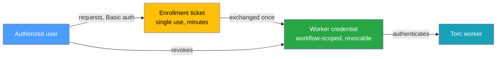
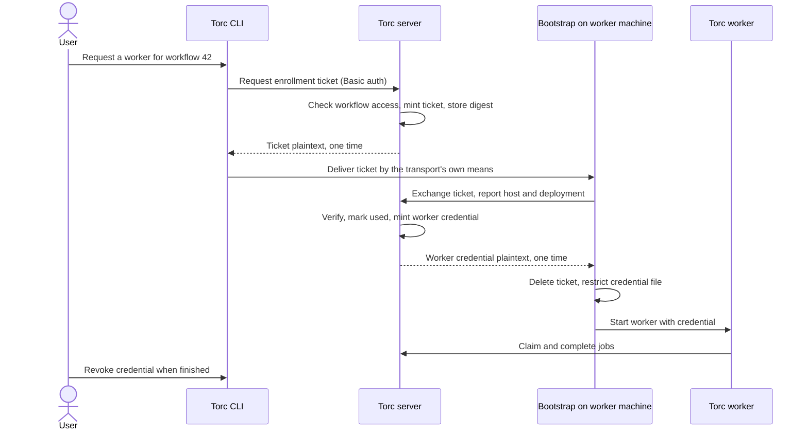

# Worker Enrollment

> 📋 **PROPOSED**: Torc does not implement this design yet. It is a prerequisite for the connected
> worker in [RDP Bootstrap for Windows Workers](./rdp-windows-workers.md), but it is not
> RDP-specific.

This document describes a proposed mechanism for provisioning scoped, revocable credentials to Torc
workers. For the authentication Torc supports today, see
[Set Up Authentication](../../core/how-to/set-up-authentication.md) and the
[Authentication section of the HTTP API design](./http-api.md#authentication).

## Overview

Let an authorized user provision a worker on a machine they do not administer, without placing a
reusable credential on that machine.

An authenticated user requests a short-lived, single-use enrollment ticket bound to one workflow.
The worker exchanges that ticket for a revocable credential limited to runner operations on that
workflow. The credential expires with the workflow run, and revoking it stops the worker from
claiming further work.

This introduces a second principal type. Torc currently authorizes by username string, so the design
is a change to the server's authorization model rather than a feature of any one transport.

## Problem Statement

Starting a worker today means giving that machine a credential that is not scoped to the work:

- `torc run` authenticates with Basic Authentication, taking the username from the environment
  (`TORC_USERNAME`, `USER`, or `USERNAME`) and the password from `--password` or `TORC_PASSWORD`.
- That password is the user's full htpasswd credential. It authorizes every workflow the user owns
  or can reach through an access group, not one workflow.
- It does not expire, and there is no way to revoke it for one machine without changing the user's
  password everywhere.
- The alternative is a browser session cookie (`TORC_COOKIE_HEADER`), which is a user session and
  should not be copied to another machine.
- The SSH remote-worker path sidesteps the problem by relying on the operator to place credentials.
  No Torc code provisions a worker credential.

This is tolerable when the worker runs on a machine the user already controls, on a shared HPC
filesystem, inside one trust boundary. It is not tolerable when the worker runs on a corporate
Windows desktop, a lab machine, or anywhere a copied secret outlives the task.

### Current Authorization Model

The relevant facts, because they set the size of this change:

| Element                                       | Current behavior                                                                                                                                                                           |
| --------------------------------------------- | ------------------------------------------------------------------------------------------------------------------------------------------------------------------------------------------ |
| `Authorization { subject, scopes, issuer }`   | The only identity the API sees, in `src/server/transport_types/auth_types.rs`                                                                                                              |
| `HtpasswdAuthenticator`                       | Verifies Basic credentials against a bcrypt htpasswd file. Bearer tokens and API keys are not honored: they fail when authentication is required and otherwise fall through to `anonymous` |
| `AuthorizationService::check_workflow_access` | Decides from the subject string: unenforced mode, workflow owner, system administrator, or access-group membership                                                                         |
| `scopes`                                      | Populated but not consulted by any authorization decision                                                                                                                                  |
| `CredentialCache`                             | Caches SHA-256 hashes of verified Basic credentials for a TTL to avoid repeated bcrypt work                                                                                                |

So there is no token store, no expiry mechanism, and no scope enforcement to extend. All three are
new.

## Design Goals

- Provision a worker credential without transmitting or storing a reusable user password.
- Scope a worker credential to one workflow and the operations a runner performs.
- Expire credentials automatically and revoke them explicitly.
- Keep the worker identity distinct from the operating-system user on the worker machine.
- Record who authorized an enrollment and which host claimed it.
- Leave the existing user-facing Basic Authentication path unchanged.

### Non-goals

- Replacing htpasswd authentication for interactive users.
- A general OAuth or OpenID Connect integration.
- Machine identity attestation. A ticket holder is trusted to be the intended worker.
- Encrypting workflow payloads. This design covers authorization, not confidentiality of job data.
- Making the enrollment ticket safe to publish. It is a bearer secret with a short life.

## Architecture

### Data Model

Two objects, distinct because they have different lifetimes and different holders.

| Property       | Enrollment ticket                                                 | Worker credential                                                     |
| -------------- | ----------------------------------------------------------------- | --------------------------------------------------------------------- |
| Created by     | An authenticated user with access to the workflow                 | Exchanging a valid ticket, never directly                             |
| Bound to       | One workflow, one deployment, the manifest digest when one exists | The same workflow and deployment, plus the run generation at exchange |
| Lifetime       | Minutes, long enough for one interactive sign-in                  | The workflow run                                                      |
| Uses           | Exactly one                                                       | Many, for the worker's lifetime                                       |
| Held by        | Whatever bootstraps the worker, briefly                           | The worker, in a file restricted to the local user                    |
| Authorizes     | One exchange                                                      | Runner operations on one workflow                                     |
| Invalidated by | Exchange, expiry, or run change                                   | Expiry or explicit revocation                                         |

Both exist at rest on the server only as digests. The plaintext ticket and credential are returned
once and never retrievable again.

### Data Flow

Delivering the ticket to the worker machine is the transport's problem, not this design's. The RDP
design carries it in a redirected bundle; an SSH launcher would write it over the SSH channel.

## Server Requirements

### Ticket Issuance

Requires an authenticated user who passes `check_workflow_access` for the target workflow. Anonymous
issuance must be rejected even when access control is not enforced, because a ticket is a
credential-minting capability.

The response carries the plaintext once. The server stores only a digest, an expiry, the workflow
and deployment binding, the issuing subject, and a used marker.

### Ticket Exchange

Unauthenticated by design, since the caller has no credential yet. The ticket is the authentication.
Exchange must:

- reject an unknown, expired, or already-used ticket with one indistinguishable error, so the
  endpoint does not confirm which tickets exist
- mark the ticket used atomically, so two concurrent exchanges cannot both succeed
- reject a ticket whose recorded manifest digest does not match the digest the caller presents
- reject a ticket whose workflow run generation has advanced since issuance
- rate-limit by source to make guessing impractical

### Credential Authentication

A worker credential must authenticate without being mistaken for a user password. It is a distinct
principal type, so the server must resolve it to an `Authorization` whose subject cannot collide
with any htpasswd username, and whose scopes are actually enforced.

This is the part that touches every endpoint. A worker credential must be able to claim jobs, report
status and results, register and update its own compute node, and read the workflow it is bound to.
It must not be able to create or delete workflows, read other workflows, manage access groups, or
reach any admin endpoint. Enforcing that requires the authorization layer to consult scopes rather
than only the subject string.

Deciding the granularity is the main open design question. A single `worker` scope bound to one
workflow is the smallest thing that satisfies the requirement, and is preferable to a general
permission system that no other caller uses.

### Revocation and Expiry

Revoking a credential must take effect promptly. The existing `CredentialCache` caches successful
Basic verifications for a TTL, so any caching of worker-credential verification needs the same
invalidation path that `POST /admin/reload-auth` already uses for htpasswd reloads.

Credentials expire with the workflow run. A worker whose credential expired mid-run should fail with
an error distinguishable from a network failure, so its logs point at the cause.

### Audit

Record ticket issuance, exchange, credential use onset, expiry, and revocation. Each entry should
carry the authorizing user, the workflow, the deployment, and the host the worker reported.
`admin_audit_log` is a precedent for an append-only table that deliberately has no foreign key to
`workflow`, so the trail survives workflow deletion.

## Client Requirements

- A command for an authorized user to request a ticket for a workflow.
- A command to list and revoke credentials for a workflow.
- `torc run` must accept a worker credential as an alternative to `--password`, read it from a file
  rather than a command-line argument, and never log it.
- The worker must not place the credential in its environment. Job subprocesses inherit the worker's
  environment, and `torc run` reads `TORC_PASSWORD` from it, so an exported credential would reach
  every job command.

## Security Model

- Tickets and credentials are random, generated from a cryptographically secure source, and long
  enough to resist guessing.
- The server stores digests, never plaintext.
- Plaintext is returned exactly once, at creation.
- A ticket authorizes one exchange for one workflow and deployment.
- A credential authorizes runner operations on one workflow.
- Exchange failures are indistinguishable from each other and rate-limited.
- Credentials are transmitted only over verified TLS. A worker must never disable certificate
  verification.
- Neither object appears in command-line arguments, process listings, or normal logs.
- Revocation is immediate and does not require changing any user's password.

## Alternatives Considered

| Alternative                            | Why rejected                                                                                                                              |
| -------------------------------------- | ----------------------------------------------------------------------------------------------------------------------------------------- |
| Reuse the user's htpasswd password     | The current situation: unscoped, non-expiring, and unrevocable without disrupting the user everywhere                                     |
| Copy the browser session cookie        | A user session is not a machine credential, and copying it broadens a credential intended for one browser                                 |
| Long-lived per-machine API key         | Removes expiry, the property that makes deployment to an unmanaged machine acceptable, and reintroduces credential distribution           |
| Signed JWTs with no server-side record | Cheap to verify, but revocation then needs a denylist. Torc already has a database on the request path, so a stored credential is simpler |
| Mutual TLS with client certificates    | Strong, but installing a client certificate on a machine the user does not administer is harder than the problem being solved             |
| Per-job credentials                    | Finer than needed. A worker claims many jobs, and the workflow run is the natural lifetime boundary                                       |

## Affected Implementation Files

The seams this design would extend:

| File                                       | Relevance                                                                             |
| ------------------------------------------ | ------------------------------------------------------------------------------------- |
| `src/server/auth.rs`                       | `HtpasswdAuthenticator`, the only authenticator; would gain a credential path         |
| `src/server/authorization.rs`              | `check_workflow_access` decides from the subject string; would need scope enforcement |
| `src/server/transport_types/auth_types.rs` | `Authorization` and `Scopes` definitions                                              |
| `src/server/credential_cache.rs`           | TTL caching that revocation must invalidate                                           |
| `src/run_jobs_cmd.rs`                      | Worker authentication options                                                         |
| `src/api_version.rs`                       | New endpoints bump the HTTP API contract version                                      |
| `torc-server/migrations/`                  | New tables for tickets, credentials, and audit entries                                |

## Limitations

1. **No machine identity attestation**: A ticket holder is trusted to be the intended worker. A
   ticket intercepted before exchange yields a valid worker credential.
2. **Ticket delivery is out of scope**: Getting the ticket to the worker machine is the transport's
   responsibility, so the weakest link may be that transport rather than this design.
3. **Revocation stops the next claim, not the current job**: A revoked worker finishes the job it is
   running. Stopping in-flight work requires job cancellation, which is a separate mechanism.
4. **Scope enforcement is new machinery**: `scopes` exists on `Authorization` but no authorization
   decision consults it, so this design must add enforcement rather than extend it. Until that
   lands, every endpoint is a potential gap.
5. **Credential caching bounds revocation latency**: If worker-credential verification is cached
   like Basic credentials, revocation takes effect no faster than the cache TTL unless it
   invalidates explicitly.

## Future Enhancements

1. **Compute-node binding**: Bind a credential to the compute node it registers, so a leaked
   credential cannot start a second worker.
2. **Host pinning**: Record the calling host at exchange and reject later use from a different host.
3. **Per-workflow lifetime policy**: Make ticket and credential lifetimes configurable rather than
   fixed defaults.
4. **Credential rotation**: Let a long-running worker rotate its credential without re-enrolling.
