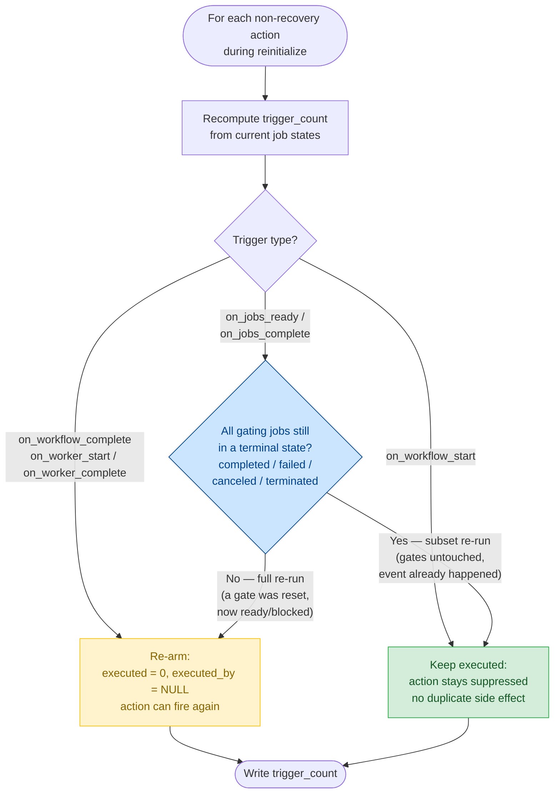

# Workflow Actions

Workflow actions enable automatic execution of commands and resource allocation in response to
workflow lifecycle events. Actions provide hooks for setup, teardown, monitoring, and dynamic
resource management throughout workflow execution.

## Overview

Actions consist of three components:

1. **Trigger** - The condition that activates the action
2. **Action Type** - The operation to perform
3. **Configuration** - Parameters specific to the action

```yaml
actions:
  - trigger_type: "on_workflow_start"
    action_type: "run_commands"
    commands:
      - "mkdir -p output logs"
      - "echo 'Workflow started' > logs/status.txt"
```

## Trigger Types

### Workflow Lifecycle Triggers

#### `on_workflow_start`

Executes once, at the workflow's first initialization.

**When it fires**: During the first `initialize_jobs`, after jobs are transitioned from
uninitialized to ready/blocked states. It does **not** fire again on reinitialize — a reinit is not
a new start (see [Workflow Reinitialization](#workflow-reinitialization)).

**Typical use cases**:

- Scheduling Slurm allocations
- Creating directory structures
- Copying initial data

```yaml
- trigger_type: "on_workflow_start"
  action_type: "run_commands"
  commands:
    - "mkdir -p output checkpoints temp"
    - "echo 'Workflow started at $(date)' > workflow.log"
```

#### `on_workflow_complete`

Executes once when all jobs reach terminal states (completed, failed, or canceled).

**When it fires**: After the last job completes, as detected by the job runner.

**Typical use cases**:

- Archiving final results
- Uploading to remote storage
- Cleanup of temporary files
- Generating summary reports

```yaml
- trigger_type: "on_workflow_complete"
  action_type: "run_commands"
  commands:
    - "tar -czf results.tar.gz output/"
    - "aws s3 cp results.tar.gz s3://bucket/results/"
    - "rm -rf temp/"
```

### Job-Based Triggers

#### `on_jobs_ready`

Executes when **all** specified jobs transition to the "ready" state.

**When it fires**: When the last specified job becomes ready to execute (all dependencies
satisfied).

**Typical use cases**:

- Scheduling Slurm allocations
- Starting phase-specific monitoring
- Pre-computation setup
- Notifications before expensive operations

```yaml
- trigger_type: "on_jobs_ready"
  action_type: "schedule_nodes"
  jobs: ["train_model_001", "train_model_002", "train_model_003"]
  scheduler: "gpu_cluster"
  scheduler_type: "slurm"
  num_allocations: 2
```

**Important**: The action triggers only when **all** matching jobs are ready, not individually as
each job becomes ready.

#### `on_jobs_complete`

Executes when **all** specified jobs reach terminal states (completed, failed, or canceled).

**When it fires**: When the last specified job finishes execution.

**Typical use cases**:

- Scheduling Slurm allocations
- Cleaning up intermediate files
- Archiving phase results
- Freeing storage space
- Phase-specific reporting

```yaml
- trigger_type: "on_jobs_complete"
  action_type: "run_commands"
  jobs: ["preprocess_1", "preprocess_2", "preprocess_3"]
  commands:
    - "echo 'Preprocessing phase complete' >> workflow.log"
    - "rm -rf raw_data/"
```

### Worker Lifecycle Triggers

Worker lifecycle triggers are **persistent by default**, meaning they execute once per worker (job
runner), not once per workflow.

#### `on_worker_start`

Executes when each worker (job runner) starts.

**When it fires**: After a job runner starts and checks for workflow actions, before claiming any
jobs.

**Typical use cases**:

- Worker-specific initialization
- Setting up worker-local logging
- Copying data to compute node local storage
- Initializing worker-specific resources
- Recording worker startup metrics

```yaml
- trigger_type: "on_worker_start"
  action_type: "run_commands"
  persistent: true  # Each worker executes this
  commands:
    - "echo 'Worker started on $(hostname) at $(date)' >> worker.log"
    - "mkdir -p worker_temp"
```

#### `on_worker_complete`

Executes when each worker completes (exits the main loop).

**When it fires**: After a worker finishes processing jobs and before it shuts down.

**Typical use cases**:

- Worker-specific cleanup
- Uploading worker-specific logs
- Recording worker completion metrics
- Cleaning up worker-local resources

```yaml
- trigger_type: "on_worker_complete"
  action_type: "run_commands"
  persistent: true  # Each worker executes this
  commands:
    - "echo 'Worker completed on $(hostname) at $(date)' >> worker.log"
    - "rm -rf worker_temp"
```

## Job Selection

For `on_jobs_ready` and `on_jobs_complete` triggers, specify which jobs to monitor.

### Exact Job Names

```yaml
- trigger_type: "on_jobs_complete"
  action_type: "run_commands"
  jobs: ["job1", "job2", "job3"]
  commands:
    - "echo 'Specific jobs complete'"
```

### Regular Expressions

```yaml
- trigger_type: "on_jobs_ready"
  action_type: "schedule_nodes"
  job_name_regexes: ["train_model_[0-9]+", "eval_.*"]
  scheduler: "gpu_cluster"
  scheduler_type: "slurm"
  num_allocations: 2
```

**Common regex patterns**:

- `"train_.*"` - All jobs starting with "train_"
- `"model_[0-9]+"` - Jobs like "model_1", "model_2"
- `".*_stage1"` - All jobs ending with "_stage1"
- `"job_(a|b|c)"` - Jobs "job_a", "job_b", or "job_c"

### Combining Selection Methods

You can use both together - the action triggers when **all** matching jobs meet the condition:

```yaml
jobs: ["critical_job"]
job_name_regexes: ["batch_.*"]
# Triggers when "critical_job" AND all "batch_*" jobs are ready/complete
```

## Action Types

### `run_commands`

Execute shell commands sequentially on a compute node.

**Configuration**:

```yaml
- trigger_type: "on_workflow_complete"
  action_type: "run_commands"
  commands:
    - "tar -czf results.tar.gz output/"
    - "aws s3 cp results.tar.gz s3://bucket/"
```

**Execution details**:

- Commands run in the workflow's output directory
- Commands execute sequentially (one after another)
- If a command fails, the action fails (but workflow continues)
- Commands run on compute nodes, not the submission node
- Uses the shell environment of the job runner process

### `schedule_nodes`

Dynamically allocate compute resources from a Slurm scheduler.

**Configuration**:

```yaml
- trigger_type: "on_jobs_ready"
  action_type: "schedule_nodes"
  jobs: ["train_model_1", "train_model_2"]
  scheduler: "gpu_cluster"
  scheduler_type: "slurm"
  num_allocations: 2
```

**Parameters**:

- `scheduler` (required) - Name of Slurm scheduler configuration (must exist in `slurm_schedulers`)
- `scheduler_type` (required) - Must be "slurm"
- `num_allocations` (required) - Number of Slurm allocation requests to submit
- `start_one_worker_per_node` (optional, default: false) - Launch one worker per allocated node via
  `srun --ntasks-per-node=1`. Use this for direct-mode workflows with single-node jobs sharing a
  multi-node allocation. Not compatible with `execution_config.mode: slurm`.

**Use cases**:

- Just-in-time resource allocation
- Cost optimization (allocate only when needed)
- Separating workflow phases with different resource requirements

## Complete Examples

Refer to this
[example](https://github.com/NatLabRockies/torc/blob/main/examples/yaml/workflow_actions_simple_slurm.yaml)

## Execution Model

### Action Claiming and Execution

1. **Atomic Claiming**: Actions are claimed atomically by workers to prevent duplicate execution
2. **Non-Persistent Actions**: Execute once per workflow (first worker to claim executes)
3. **Persistent Actions**: Can be claimed and executed by multiple workers
4. **Trigger Counting**: Job-based triggers increment a counter as jobs transition; action becomes
   pending when count reaches threshold
5. **Immediate Availability**: Worker lifecycle actions are immediately available after workflow
   initialization

### Action Lifecycle

```
[Workflow Created]
    ↓
[initialize_jobs called]
    ↓
├─→ on_workflow_start actions become pending
├─→ on_worker_start actions become pending (persistent)
├─→ on_worker_complete actions become pending (persistent)
└─→ on_jobs_ready actions wait for job transitions
    ↓
[Worker Claims and Executes Actions]
    ↓
[Jobs Execute]
    ↓
[Jobs Complete]
    ↓
├─→ on_jobs_complete actions become pending when all specified jobs complete
└─→ on_workflow_complete actions become pending when all jobs complete
    ↓
[Workers Exit]
    ↓
[on_worker_complete actions execute per worker]
```

### Important Characteristics

1. **No Rollback**: Failed actions don't affect workflow execution
2. **Compute Node Execution**: Actions run on compute nodes via job runners
3. **One-Time Triggers**: Non-persistent actions trigger once when conditions are first met
4. **No Inter-Action Dependencies**: Actions don't depend on other actions
5. **Concurrent Workers**: Multiple workers can execute different actions simultaneously

### Workflow Reinitialization

Every reinitialize entry point — `torc workflows reinit`, `torc jobs reset-status --reinit`,
`torc recover`, and the Slurm `regenerate`/`watch` paths — funnels through the single server routine
`reset_actions_for_reinitialize`, which runs as part of `initialize_jobs`. For each action it
recomputes `trigger_count` from the current job states and then decides whether to **re-arm** the
action (clear `executed`/`executed_by` so it can fire again on the new run) or **keep it executed**
(leave it suppressed).

The decision follows one rule, independent of `action_type`:

> Re-arm an action **iff its triggering condition will genuinely re-occur in the new run.**

A user who reinitializes after resetting a _subset_ of jobs expects only those jobs to re-run.
Actions tied to events that are not happening again must not re-fire — a re-fired action re-submits
its Slurm allocation (`schedule_nodes`) or re-runs its commands (`run_commands`), and that duplicate
side effect is the bug. This is why the decision is **not** specific to `schedule_nodes`: the hazard
is "duplicate side effect," not "duplicate allocation."

#### Re-arm decision



Per trigger:

- **`on_workflow_start` → keep.** The workflow starts exactly once in its lifetime; a reinitialize
  is not a new start. This is what stops plain `reinit` / `reset-status --reinit` from re-running
  start-time setup or re-submitting the original node count. (A never-fired action keeps
  `executed = 0` and still fires, so a first real initialize is unaffected.)
- **`on_jobs_ready` / `on_jobs_complete` → keep iff the gating jobs are still all terminal.** That
  is the _subset_ re-run (the gates were untouched, so the event already happened and is not
  recurring). Re-arm when any gate was reset — the _full_ re-run, where that job will run again and
  its action should fire again with it.
- **`on_workflow_complete`, `on_worker_start`, `on_worker_complete` → re-arm.** These recur every
  run (the workflow will complete again; new workers start), so they should fire again.

**Why "terminal state" and not `trigger_count`.** The job-gated test measures the gating jobs with
the `on_jobs_complete` notion (terminal jobs only), _not_ the action's own `trigger_count`. For an
`on_jobs_ready` action a reset gate returns to `Ready`, and `Ready` already satisfies
`on_jobs_ready`, so `trigger_count` cannot distinguish a freshly-reset gate from one that already
completed. Using it would wrongly suppress the action on a full re-run and stall the workflow. The
terminal-state count drops as soon as a gate is reset, which is exactly the signal that the action
must fire again.

**Example — subset re-run vs. full re-run**:

- `gate_job` runs first; an `on_jobs_complete` action (a `schedule_nodes` allocation or a
  `run_commands` archive step) fires when it completes. A later `work_job` depends on `gate_job`.

_Subset re-run_ (the common reschedule-the-failure case):

1. `gate_job` completes (action fires); `work_job` later fails.
2. User resets only the failed job and reinitializes. `gate_job` stays `Completed` (terminal).
3. The action is **kept executed** — it is not re-armed, so no duplicate allocation/command runs
   when a worker starts.

_Full re-run_ (the gate itself is re-run):

1. Same first run as above.
2. User resets `gate_job` itself and reinitializes. `gate_job` returns to a non-terminal state.
3. The action is **re-armed**, so when `gate_job` completes again in the new run it fires again.

With multiple gating jobs, the action is only kept executed when **all** of them remain terminal;
resetting any one of them re-arms it.

The client-side `recover`/`regenerate` guards (`mark_satisfied_schedule_actions_executed`) remain as
defense in depth, but the server is now the single point that prevents reinit from resurrecting an
already-satisfied action, so all entry points are covered uniformly.

## Limitations

1. **No Action Dependencies**: Actions cannot depend on other actions completing
2. **No Conditional Execution**: Actions cannot have conditional logic (use multiple actions with
   different job selections instead)
3. **No Action Retries**: Failed actions are not automatically retried
4. **Single Action Type**: Each action has one action_type (cannot combine run_commands and
   schedule_nodes)
5. **Job Selectors Are Spec-Time Only**: An action's job names/patterns are fixed when the workflow
   is created and don't update if new jobs are added later (e.g. by
   [`spawn_jobs`](../../core/tutorials/dynamic-jobs.md))

For complex workflows requiring these features, consider:

- Using job dependencies to order operations
- Creating separate jobs for conditional logic
- Implementing retry logic within command scripts
- Creating multiple actions for different scenarios
