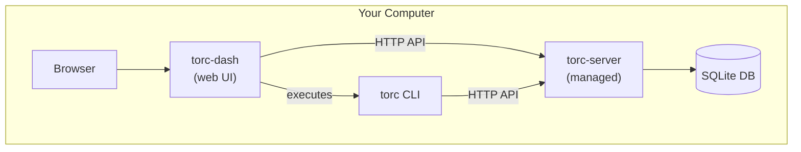
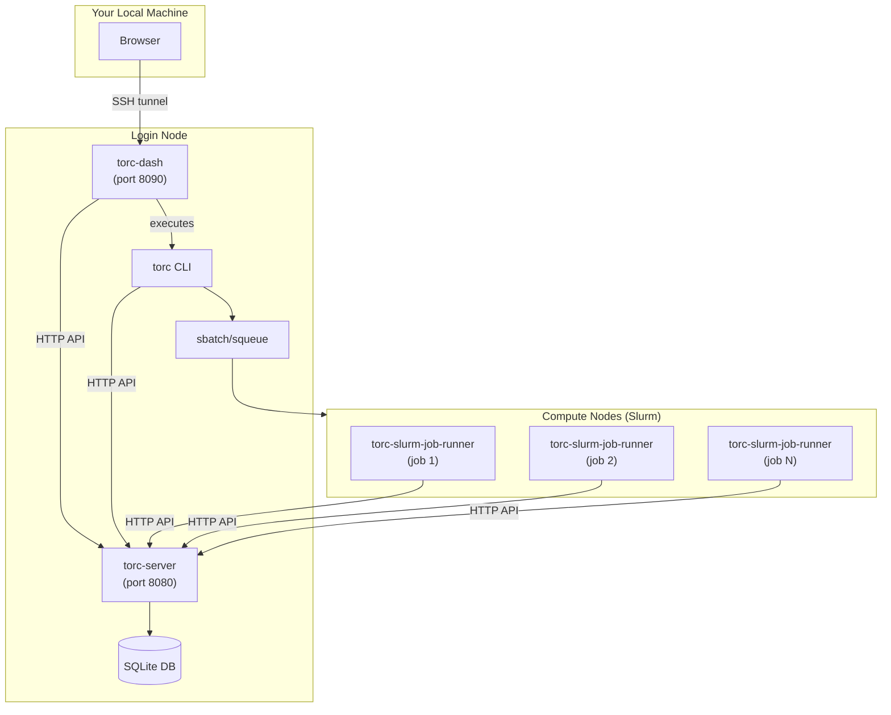
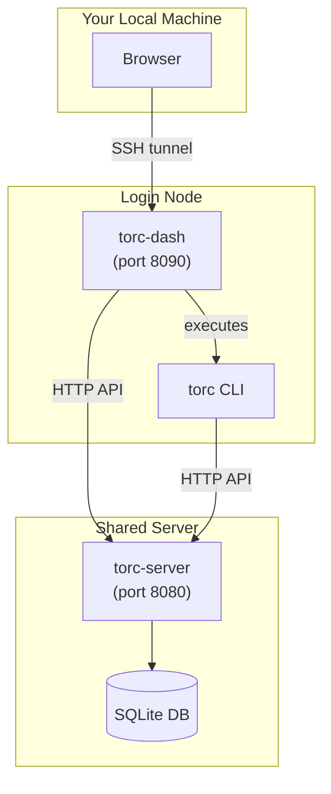

# Dashboard Deployment Tutorial

This tutorial covers three common deployment scenarios for the Torc web dashboard (`torc-dash`).
Each scenario addresses different environments and use cases.

> **Prefer the terminal?** If you work primarily in SSH sessions or terminal environments, consider
> using the [Terminal UI (TUI)](../../core/monitoring/tui.md) instead. The TUI provides the same
> workflow and job management capabilities without requiring a web browser or SSH tunnels.

## Overview of Deployment Scenarios

| Scenario                 | Environment                       | Use Case                                        |
| ------------------------ | --------------------------------- | ----------------------------------------------- |
| 1. Standalone            | Local computer                    | Single-computer workflows, development, testing |
| 2. All-in-One Login Node | HPC login node                    | Small HPC workflows (< 100 jobs)                |
| 3. Shared Server         | HPC login node + dedicated server | Large-scale multi-user HPC workflows            |

## Prerequisites

Before starting, ensure you have:

1. **Built Torc binaries** (see [Installation](../installation.md)):
   ```bash
   cargo build --release --workspace
   ```

2. **Added binaries to PATH**:
   ```bash
   export PATH="$PATH:/path/to/torc/target/release"
   ```

3. **Initialized the database** (if not using standalone mode):
   ```bash
   sqlx database setup
   ```

---

## Scenario 1: Local Development (Standalone Mode)

**Best for**: Single-computer workflows on your laptop or workstation. Also ideal for development,
testing, and learning Torc.

This is the simplest setup - everything runs on one machine with a single command. Use this when you
want to run workflows entirely on your local computer without HPC resources.

### Architecture



### Setup

**Step 1: Start the dashboard in standalone mode**

```bash
torc-dash --standalone
```

This single command:

- Automatically starts `torc-server` on a free port
- Starts the dashboard on http://127.0.0.1:8090
- Configures the dashboard to connect to the managed server

**Step 2: Open your browser**

Navigate to http://localhost:8090

**Step 3: Create and run a workflow**

1. Click **Create Workflow**
2. Upload a workflow specification file (YAML, JSON, or KDL)
3. Click **Create**
4. Click **Initialize** on the new workflow
5. Click **Run Locally** to execute

### Configuration Options

```bash
# Custom dashboard port
torc-dash --standalone --port 8080 --server-host localhost

# Specify database location
torc-dash --standalone --database /path/to/my.db --server-host localhost

# Faster job completion detection
torc-dash --standalone --server-host localhost --completion-check-interval-secs 2

# Specify binary paths (if not in PATH)
torc-dash --standalone \
  --server-host localhost \
  --torc-bin /path/to/torc \
  --torc-server-bin /path/to/torc-server
```

### Stopping

Press `Ctrl+C` in the terminal. This stops both the dashboard and the managed server.

---

## Scenario 2: All-in-One Login Node

**Best for**: Small HPC workflows (fewer than 100 jobs) where you want the complete Torc stack
running on the login node, with jobs submitted to Slurm.

This is the simplest HPC setup - everything runs on the login node. It's ideal for individual users
running small HPC workflows without needing a dedicated server infrastructure.

**Important**: Login nodes are shared resources. The torc-dash and torc-server applications consume
minimal resources when workflows are small (e.g., less than 100 jobs). If you run these applications
on bigger workflows, especially with faster job completion interval checks, you may impact other
users.

### Architecture



### Setup

**Step 1: Start a tmux session** This ensures that your server continues to run if your computer is
disconnected from the network.

```bash
tmux
```

**Step 2: Start torc-dash on the login node with its own torc server**

```bash
torc-dash --standalone \
  --database /scratch/$USER/torc.db \
  --port 8090 \
  --server-host kl1.hsn.cm.kestrel.hpc.nrel.gov \
  --completion-check-interval-secs 60
```

**Step 3: Access via SSH tunnel**

From your local machine:

```bash
ssh -L 8090:localhost:8090 user@login-node
```

> **Important**: Use `localhost` in the tunnel command, not the login node's hostname. This works
> because torc-dash binds to 127.0.0.1 by default.

Open http://localhost:8090 in your browser.

### Submitting to Slurm

**Via Dashboard:**

1. Create a workflow with Slurm scheduler configuration
2. Click **Initialize**
3. Click **Submit** (not "Run Locally")

**Via CLI:**

```bash
# Create workflow with Slurm actions
torc workflows create my_slurm_workflow.yaml

# Submit to Slurm
torc submit <workflow_id>
```

### Monitoring Slurm Jobs

The dashboard shows job status updates as Slurm jobs progress:

1. Go to **Details** tab
2. Select **Jobs**
3. Enable **Auto-refresh**
4. Watch status change from `pending` → `running` → `completed`

You can also monitor via:

- **Events** tab for state transitions
- **Debugging** tab for job logs after completion

---

## Scenario 3: Shared Server on HPC

**Best for**: Large-scale multi-user HPC environments where a central `torc-server` runs
persistently on a dedicated server, and multiple users access it via `torc-dash` from login nodes.

This is the most scalable setup, suitable for production deployments with many concurrent users and
large workflows.

### Architecture



### Setup

**Step 1: Start torc-server on the shared server**

On the shared server (e.g., a dedicated service node):

```bash
torc-server run \
  --port 8080 \
  --database /shared/storage/torc.db \
  --completion-check-interval-secs 60
```

For production, consider running as a systemd service:

```bash
torc-server service install --user \
  --port 8080 \
  --database /shared/storage/torc.db
```

**Step 2: Start torc-dash on a login node**

SSH to the login node and start the dashboard:

```bash
# Connect to the shared server
export TORC_API_URL="http://shared-server:8080/torc-service/v1"

# Start dashboard (accessible only from login node by default)
torc-dash --port 8090
```

**Step 3: Access the dashboard via SSH tunnel**

From your local machine, create an SSH tunnel:

```bash
ssh -L 8090:localhost:8090 user@login-node
```

> **Important**: Use `localhost` in the tunnel command, not the login node's hostname. The tunnel
> forwards your local port to `localhost:8090` _as seen from the login node_, which matches where
> torc-dash binds (127.0.0.1:8090).

Then open http://localhost:8090 in your local browser.

### Using the CLI

Users can also interact with the shared server via CLI:

```bash
# Set the API URL
export TORC_API_URL="http://shared-server:8080/torc-service/v1"

# Create and run workflows
torc workflows create my_workflow.yaml
torc workflows run <workflow_id>
```

### Authentication

For multi-user environments, enable authentication:

```bash
# Create htpasswd file with users
torc-htpasswd create /path/to/htpasswd
torc-htpasswd add /path/to/htpasswd alice
torc-htpasswd add /path/to/htpasswd bob

# Start server with authentication
torc-server run \
  --port 8080 \
  --auth-file /path/to/htpasswd \
  --require-auth
```

See [Authentication](../admin/authentication.md) for details.

---

## Comparison Summary

| Feature            | Standalone                | All-in-One Login Node            | Shared Server          |
| ------------------ | ------------------------- | -------------------------------- | ---------------------- |
| Setup complexity   | Low                       | Medium                           | Medium-High            |
| Multi-user support | No                        | Single user                      | Yes                    |
| Slurm integration  | No                        | Yes                              | Yes                    |
| Database location  | Local                     | Login node                       | Shared storage         |
| Persistence        | Session only              | Depends on setup                 | Persistent             |
| Best for           | Single-computer workflows | Small HPC workflows (< 100 jobs) | Large-scale production |

## Troubleshooting

### Cannot connect to server

```bash
# Check if server is running
curl http://localhost:8080/torc-service/v1/workflows

# Check server logs
tail -f torc-server.log
```

### SSH tunnel not working

```bash
# Verify tunnel is established
lsof -i :8090

# Check for port conflicts
netstat -tuln | grep 8090
```

### Slurm jobs not starting

```bash
# Check Slurm queue
squeue --me

# Check Slurm job logs
cat output/slurm_output_*.e
```

### Compute nodes can't reach the server

If Slurm jobs fail with connection errors (e.g., "Connection refused" or "Name not resolved"):

1. Verify connectivity from a compute node:
   ```bash
   srun --pty curl -s http://$(hostname):8080/torc-service/v1/workflows
   ```

2. On some HPC systems, the login node's default hostname is not routable from compute nodes. For
   example, on NREL's Kestrel, login node `kl1` must be accessed as
   `kl1.hsn.cm.kestrel.hpc.nrel.gov` from compute nodes. Check with your HPC administrators for the
   correct routable hostname, then use `--host`:
   ```bash
   torc-server run --host <routable-hostname> --port 8080 ...
   ```

### Dashboard shows "Disconnected"

- Verify API URL in Configuration tab
- Check network connectivity to server
- Ensure server is running and accessible

## Next Steps

- [Network Connectivity](../../core/concepts/network-connectivity.md) - Server bind addresses and
  deployment scenarios
- [Web Dashboard Guide](../../core/monitoring/dashboard.md) - Complete feature reference
- [Working with Slurm](../hpc/slurm.md) - Detailed Slurm configuration
- [Server Deployment](../admin/server-deployment.md) - Production server setup
- [Authentication](../admin/authentication.md) - Securing your deployment
